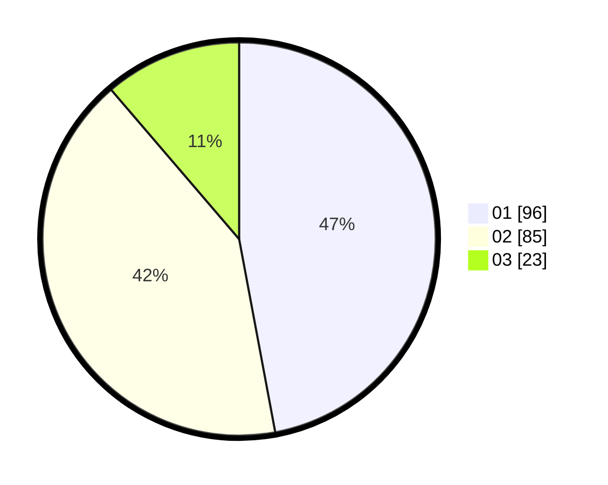

# Hasil

Hasil perolehan suara paslon dapat dilihat pada file paslon-01.txt, paslon-02.txt, dan paslon-03.txt.

Jika tidak ada, artinya data tersebut belum ada pada SIREKAP.

## Perolehan Suara

 * Paslon 01: **96**.
 * Paslon 02: **85**.
 * Paslon 03: **23**.

## Foto C Plano

https://sirekap-obj-formc.kpu.go.id/cd55/pemilu/ppwp/31/75/07/10/03/3175071003036-20240215-024230--21d6724f-939b-4103-9cbe-0d8e9e4dcc7f.jpg

https://sirekap-obj-formc.kpu.go.id/cd55/pemilu/ppwp/31/75/07/10/03/3175071003036-20240215-015203--d783289f-70df-4faf-a31b-dafc8cd32500.jpg

https://sirekap-obj-formc.kpu.go.id/cd55/pemilu/ppwp/31/75/07/10/03/3175071003036-20240215-015331--ffd9a486-0c23-46c7-b9e2-02813eade0d5.jpg
