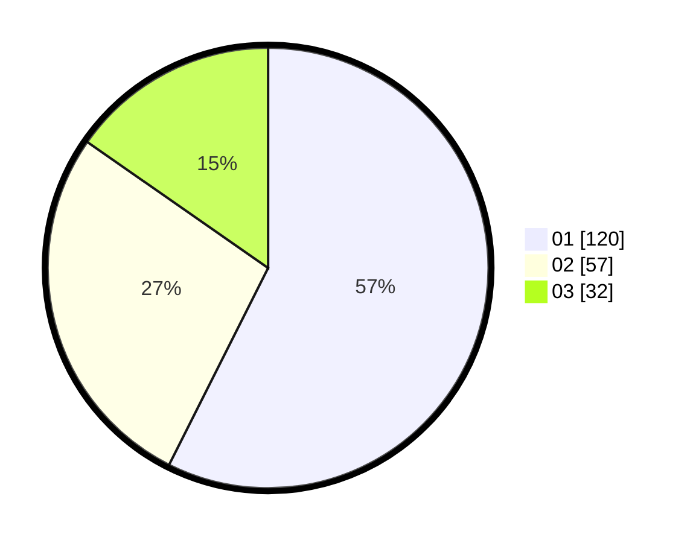

# Hasil

Hasil perolehan suara paslon dapat dilihat pada file paslon-01.txt, paslon-02.txt, dan paslon-03.txt.

Jika tidak ada, artinya data tersebut belum ada pada SIREKAP.

## Perolehan Suara

 * Paslon 01: **120**.
 * Paslon 02: **57**.
 * Paslon 03: **32**.

## Foto C Plano

https://sirekap-obj-formc.kpu.go.id/3238/pemilu/ppwp/31/75/07/10/03/3175071003039-20240214-221402--c767a6c0-6a4c-417a-b8ac-d574e777e840.jpg

https://sirekap-obj-formc.kpu.go.id/3238/pemilu/ppwp/31/75/07/10/03/3175071003039-20240214-221540--821f3d52-1314-489d-9d89-98daeb2544bd.jpg

https://sirekap-obj-formc.kpu.go.id/3238/pemilu/ppwp/31/75/07/10/03/3175071003039-20240214-221711--700f0fe1-d7d6-4924-b2e7-f25c239f4552.jpg
