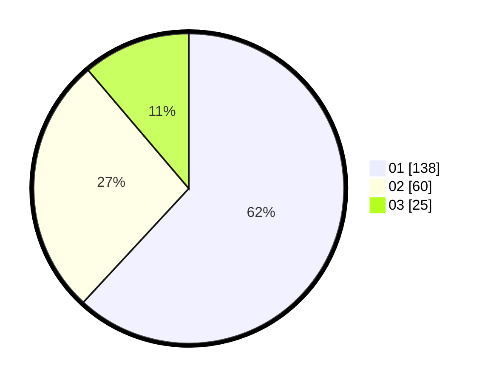

# Hasil

Hasil perolehan suara paslon dapat dilihat pada file paslon-01.txt, paslon-02.txt, dan paslon-03.txt.

Jika tidak ada, artinya data tersebut belum ada pada SIREKAP.

## Perolehan Suara

 * Paslon 01: **138**.
 * Paslon 02: **60**.
 * Paslon 03: **25**.

## Foto C Plano

https://sirekap-obj-formc.kpu.go.id/48f1/pemilu/ppwp/31/75/07/10/03/3175071003047-20240216-015737--0f4f8526-bdad-4795-9660-f59a900ce6ba.jpg

https://sirekap-obj-formc.kpu.go.id/48f1/pemilu/ppwp/31/75/07/10/03/3175071003047-20240216-015739--f64b6d29-b2a2-4309-9a88-2fd17a377b49.jpg

https://sirekap-obj-formc.kpu.go.id/48f1/pemilu/ppwp/31/75/07/10/03/3175071003047-20240216-015738--1e55aef6-0cd0-42bc-aec2-fb8bd23a7d89.jpg

## DATA PEMILIH TETAP

Jumlah pemilih dalam DPT: **263**.
 * L: **140**.
 * P: **123**.

## DATA PENGGUNA HAK PILIH

Jumlah pengguna hak pilih dalam DPT: **216**.
 * L: **113**.
 * P: **103**.

Jumlah pengguna hak pilih dalam DPTb: **1**.
 * L: **0**.
 * P: **1**.

Jumlah pengguna hak pilih dalam DPK: **9**.
 * L: **5**.
 * P: **4**.

Jumlah pengguna hak pilih: **226**.
 * L: **118**.
 * P: **108**.

## JUMLAH SUARA SAH DAN TIDAK SAH

JUMLAH SELURUH SUARA SAH: **223**.

JUMLAH SUARA TIDAK SAH: **3**.

JUMLAH SELURUH SUARA SAH DAN SUARA TIDAK SAH: **226**.
