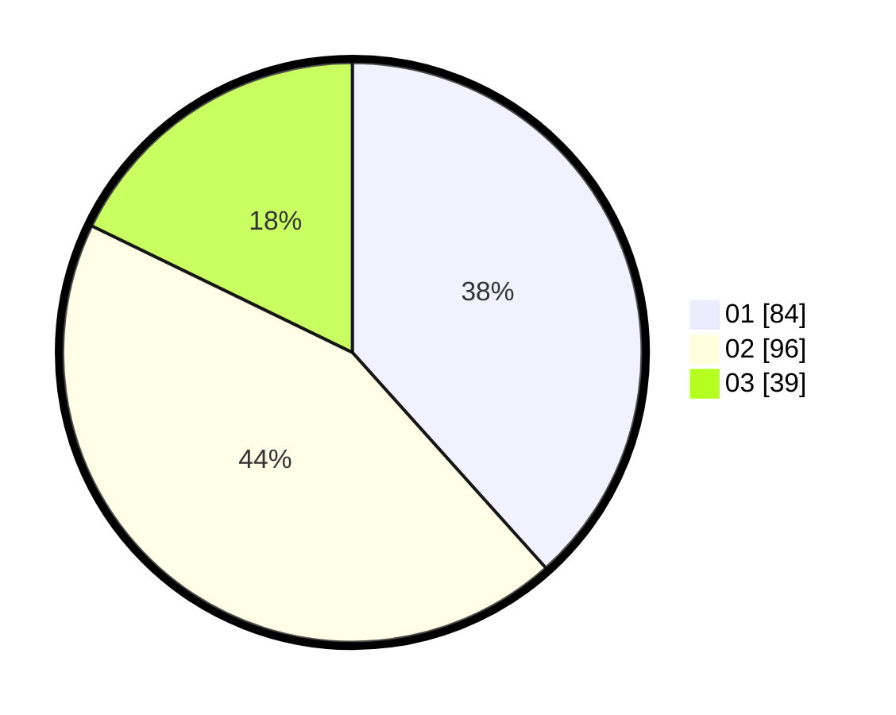

# Hasil

Hasil perolehan suara paslon dapat dilihat pada file paslon-01.txt, paslon-02.txt, dan paslon-03.txt.

Jika tidak ada, artinya data tersebut belum ada pada SIREKAP.

## Perolehan Suara

 * Paslon 01: **84**.
 * Paslon 02: **96**.
 * Paslon 03: **39**.

## Foto C Plano

https://sirekap-obj-formc.kpu.go.id/3dd8/pemilu/ppwp/31/75/07/10/03/3175071003051-20240216-094051--4ca005c5-cf8f-45d2-b736-b2ce1ecc0cf4.jpg

https://sirekap-obj-formc.kpu.go.id/3dd8/pemilu/ppwp/31/75/07/10/03/3175071003051-20240216-094053--33c6b847-2686-402b-9b81-631cd7399a98.jpg

https://sirekap-obj-formc.kpu.go.id/3dd8/pemilu/ppwp/31/75/07/10/03/3175071003051-20240216-094052--922741ee-0d47-4d68-b87f-6b9ab9f94474.jpg

## DATA PEMILIH TETAP

Jumlah pemilih dalam DPT: **0**.
 * L: **0**.
 * P: **0**.

## DATA PENGGUNA HAK PILIH

Jumlah pengguna hak pilih dalam DPT: **221**.
 * L: **107**.
 * P: **114**.

Jumlah pengguna hak pilih dalam DPTb: **2**.
 * L: **1**.
 * P: **1**.

Jumlah pengguna hak pilih dalam DPK: **0**.
 * L: **0**.
 * P: **0**.

Jumlah pengguna hak pilih: **223**.
 * L: **108**.
 * P: **115**.

## JUMLAH SUARA SAH DAN TIDAK SAH

JUMLAH SELURUH SUARA SAH: **219**.

JUMLAH SUARA TIDAK SAH: **4**.

JUMLAH SELURUH SUARA SAH DAN SUARA TIDAK SAH: **223**.
