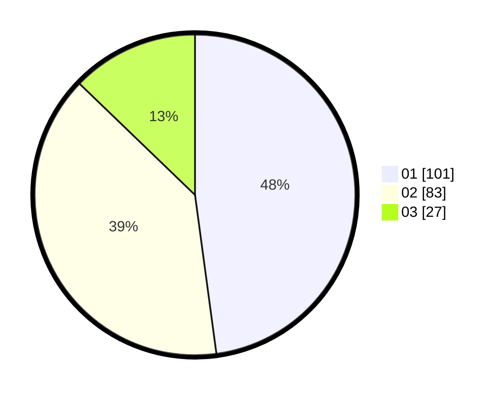

# Hasil

Hasil perolehan suara paslon dapat dilihat pada file paslon-01.txt, paslon-02.txt, dan paslon-03.txt.

Jika tidak ada, artinya data tersebut belum ada pada SIREKAP.

## Perolehan Suara

 * Paslon 01: **101**.
 * Paslon 02: **83**.
 * Paslon 03: **27**.

## Foto C Plano

https://sirekap-obj-formc.kpu.go.id/0949/pemilu/ppwp/31/75/07/10/03/3175071003052-20240214-215237--668872b8-ba15-4b06-81bc-6581f5c1a3ea.jpg

https://sirekap-obj-formc.kpu.go.id/0949/pemilu/ppwp/31/75/07/10/03/3175071003052-20240214-215427--88d58895-92e7-488f-9393-7f4a774779b5.jpg

https://sirekap-obj-formc.kpu.go.id/0949/pemilu/ppwp/31/75/07/10/03/3175071003052-20240214-215552--94bf9da2-9cea-4e60-875b-1ad2f81044b7.jpg

## DATA PEMILIH TETAP

Jumlah pemilih dalam DPT: **267**.
 * L: **133**.
 * P: **134**.

## DATA PENGGUNA HAK PILIH

Jumlah pengguna hak pilih dalam DPT: **267**.
 * L: **133**.
 * P: **134**.

Jumlah pengguna hak pilih dalam DPTb: **0**.
 * L: **0**.
 * P: **0**.

Jumlah pengguna hak pilih dalam DPK: **0**.
 * L: **0**.
 * P: **0**.

Jumlah pengguna hak pilih: **267**.
 * L: **133**.
 * P: **134**.

## JUMLAH SUARA SAH DAN TIDAK SAH

JUMLAH SELURUH SUARA SAH: **217**.

JUMLAH SUARA TIDAK SAH: **2**.

JUMLAH SELURUH SUARA SAH DAN SUARA TIDAK SAH: **219**.
