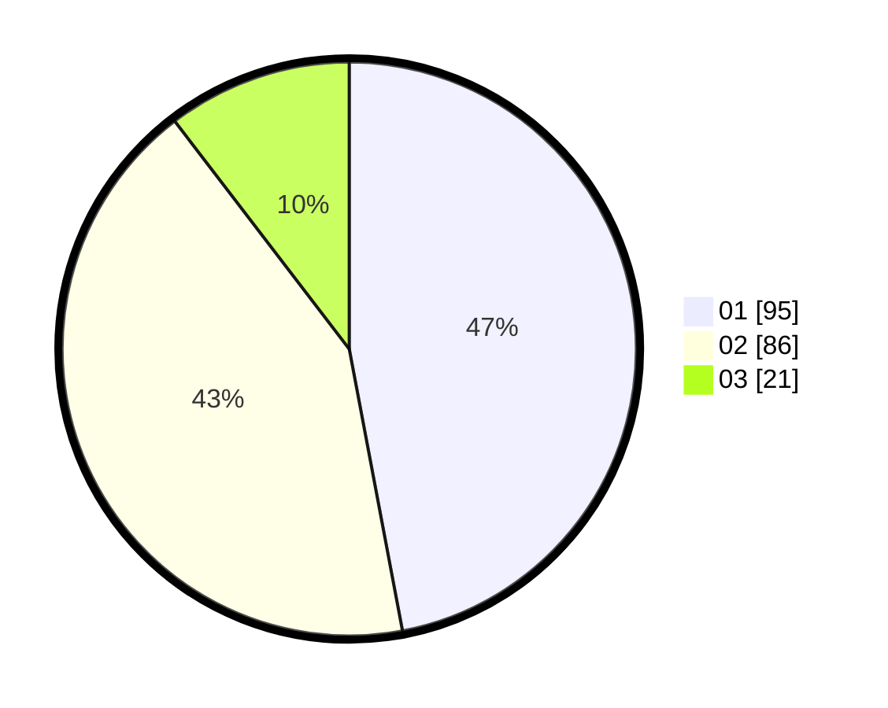

# Hasil

Hasil perolehan suara paslon dapat dilihat pada file paslon-01.txt, paslon-02.txt, dan paslon-03.txt.

Jika tidak ada, artinya data tersebut belum ada pada SIREKAP.

## Perolehan Suara

 * Paslon 01: **95**.
 * Paslon 02: **86**.
 * Paslon 03: **21**.

## Foto C Plano

https://sirekap-obj-formc.kpu.go.id/0c97/pemilu/ppwp/31/75/07/10/03/3175071003055-20240214-213558--0c2264af-6ba8-4d37-9db3-c11a81391d93.jpg

https://sirekap-obj-formc.kpu.go.id/0c97/pemilu/ppwp/31/75/07/10/03/3175071003055-20240214-213807--f23e26d6-f3f4-481d-b99f-33997a7ad97f.jpg

https://sirekap-obj-formc.kpu.go.id/0c97/pemilu/ppwp/31/75/07/10/03/3175071003055-20240214-214426--10887711-11f0-44a8-8f02-6f7b5912efe9.jpg
