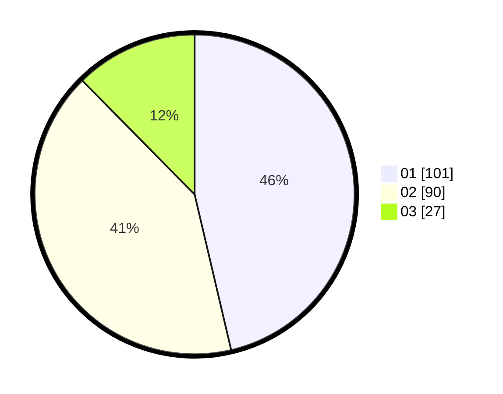

# Hasil

Hasil perolehan suara paslon dapat dilihat pada file paslon-01.txt, paslon-02.txt, dan paslon-03.txt.

Jika tidak ada, artinya data tersebut belum ada pada SIREKAP.

## Perolehan Suara

 * Paslon 01: **101**.
 * Paslon 02: **90**.
 * Paslon 03: **27**.

## Foto C Plano

https://sirekap-obj-formc.kpu.go.id/3313/pemilu/ppwp/31/75/07/10/03/3175071003056-20240214-155424--8c5664e6-fb6e-4300-9db4-4ad0ea83b4c4.jpg

https://sirekap-obj-formc.kpu.go.id/3313/pemilu/ppwp/31/75/07/10/03/3175071003056-20240214-155349--caec0181-b2ac-4b19-bb51-2d6edeb8fcc9.jpg

https://sirekap-obj-formc.kpu.go.id/3313/pemilu/ppwp/31/75/07/10/03/3175071003056-20240214-155620--317c88c8-76d9-4c02-ab4c-b5ff5806fa34.jpg

## DATA PEMILIH TETAP

Jumlah pemilih dalam DPT: **267**.
 * L: **136**.
 * P: **131**.

## DATA PENGGUNA HAK PILIH

Jumlah pengguna hak pilih dalam DPT: **218**.
 * L: **112**.
 * P: **106**.

Jumlah pengguna hak pilih dalam DPTb: **2**.
 * L: **1**.
 * P: **1**.

Jumlah pengguna hak pilih dalam DPK: **0**.
 * L: **0**.
 * P: **0**.

Jumlah pengguna hak pilih: **220**.
 * L: **113**.
 * P: **107**.

## JUMLAH SUARA SAH DAN TIDAK SAH

JUMLAH SELURUH SUARA SAH: **218**.

JUMLAH SUARA TIDAK SAH: **2**.

JUMLAH SELURUH SUARA SAH DAN SUARA TIDAK SAH: **220**.
