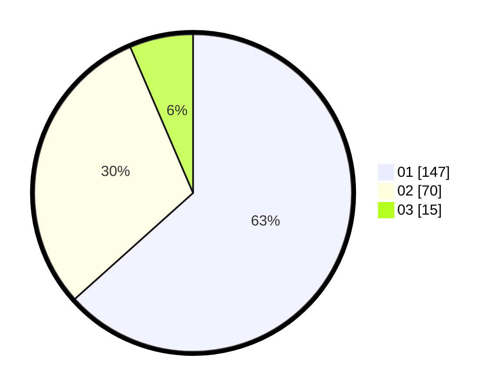

# Hasil

Hasil perolehan suara paslon dapat dilihat pada file paslon-01.txt, paslon-02.txt, dan paslon-03.txt.

Jika tidak ada, artinya data tersebut belum ada pada SIREKAP.

## Perolehan Suara

 * Paslon 01: **147**.
 * Paslon 02: **70**.
 * Paslon 03: **15**.

## Foto C Plano

https://sirekap-obj-formc.kpu.go.id/8653/pemilu/ppwp/31/75/07/10/03/3175071003063-20240215-000223--3642511d-d8f3-407a-bd93-4f89bbbdf86a.jpg

https://sirekap-obj-formc.kpu.go.id/8653/pemilu/ppwp/31/75/07/10/03/3175071003063-20240215-014628--ed536a1a-c861-4a0c-866a-4b5e295fcb3e.jpg

https://sirekap-obj-formc.kpu.go.id/8653/pemilu/ppwp/31/75/07/10/03/3175071003063-20240215-014820--bc7ee04d-81ce-49b8-b6e0-3d33b087e193.jpg
