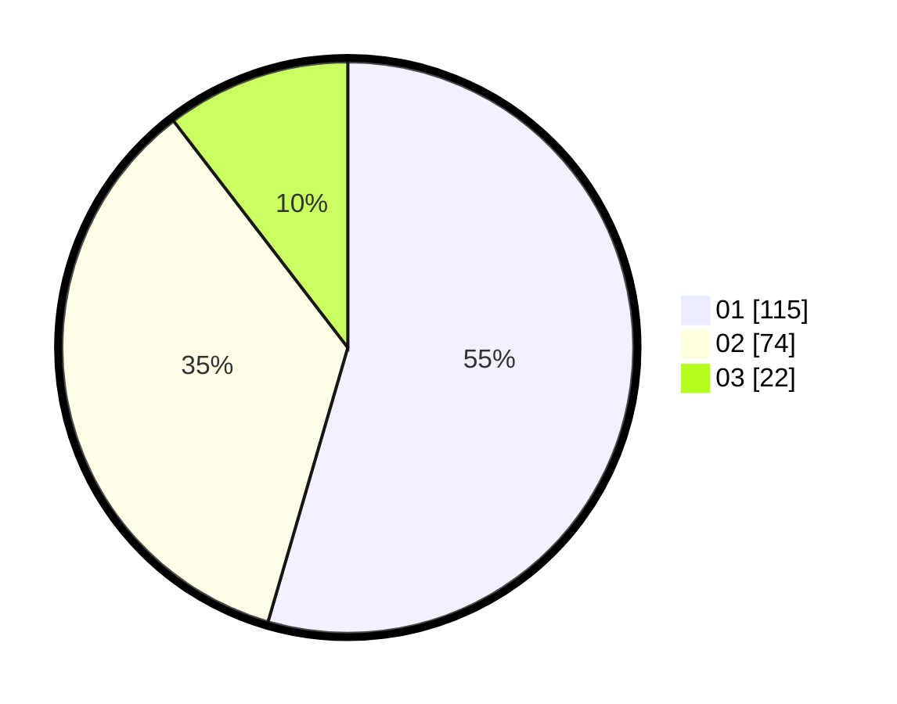

# Hasil

Hasil perolehan suara paslon dapat dilihat pada file paslon-01.txt, paslon-02.txt, dan paslon-03.txt.

Jika tidak ada, artinya data tersebut belum ada pada SIREKAP.

## Perolehan Suara

 * Paslon 01: **115**.
 * Paslon 02: **74**.
 * Paslon 03: **22**.

## Foto C Plano

https://sirekap-obj-formc.kpu.go.id/20dd/pemilu/ppwp/31/75/07/10/03/3175071003068-20240215-222058--90618e31-1284-4089-b434-881670310240.jpg

https://sirekap-obj-formc.kpu.go.id/20dd/pemilu/ppwp/31/75/07/10/03/3175071003068-20240215-222103--5c31084f-6ab1-4754-bf30-990647ef4e1a.jpg

https://sirekap-obj-formc.kpu.go.id/20dd/pemilu/ppwp/31/75/07/10/03/3175071003068-20240215-222100--de89edb3-0cf8-4349-aeec-e88726f60474.jpg

## DATA PEMILIH TETAP

Jumlah pemilih dalam DPT: **276**.
 * L: **143**.
 * P: **133**.

## DATA PENGGUNA HAK PILIH

Jumlah pengguna hak pilih dalam DPT: **210**.
 * L: **99**.
 * P: **111**.

Jumlah pengguna hak pilih dalam DPTb: **1**.
 * L: **0**.
 * P: **1**.

Jumlah pengguna hak pilih dalam DPK: **1**.
 * L: **1**.
 * P: **0**.

Jumlah pengguna hak pilih: **212**.
 * L: **100**.
 * P: **112**.

## JUMLAH SUARA SAH DAN TIDAK SAH

JUMLAH SELURUH SUARA SAH: **211**.

JUMLAH SUARA TIDAK SAH: **1**.

JUMLAH SELURUH SUARA SAH DAN SUARA TIDAK SAH: **212**.
