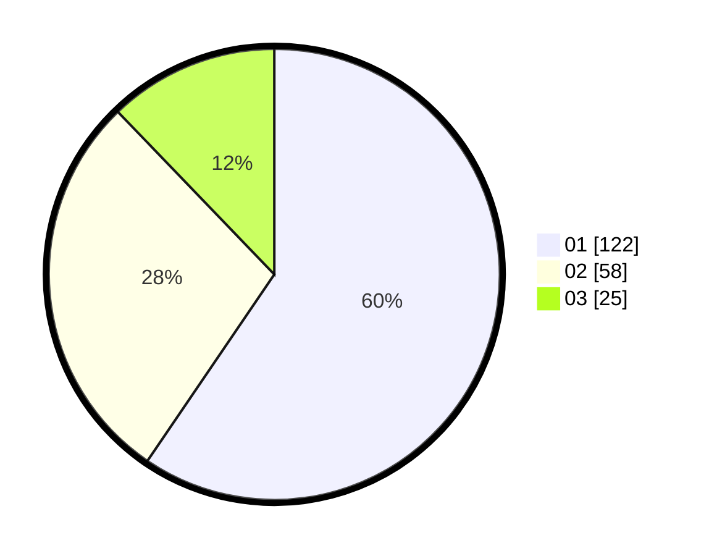

# Hasil

Hasil perolehan suara paslon dapat dilihat pada file paslon-01.txt, paslon-02.txt, dan paslon-03.txt.

Jika tidak ada, artinya data tersebut belum ada pada SIREKAP.

## Perolehan Suara

 * Paslon 01: **122**.
 * Paslon 02: **58**.
 * Paslon 03: **25**.

## Foto C Plano

https://sirekap-obj-formc.kpu.go.id/51e6/pemilu/ppwp/31/75/07/10/03/3175071003072-20240214-232033--09899b77-2505-460c-a0fc-f5644ab3be71.jpg

https://sirekap-obj-formc.kpu.go.id/51e6/pemilu/ppwp/31/75/07/10/03/3175071003072-20240214-232220--d033a5e4-7f6f-40b5-9b5e-b332b0e522a6.jpg

https://sirekap-obj-formc.kpu.go.id/51e6/pemilu/ppwp/31/75/07/10/03/3175071003072-20240214-232335--a7e17248-5a74-4a6e-9fb9-0bff503684db.jpg
