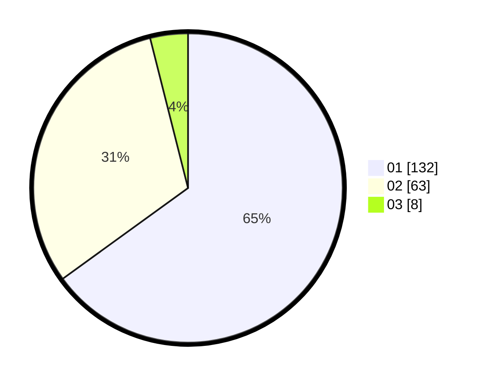

# Hasil

Hasil perolehan suara paslon dapat dilihat pada file paslon-01.txt, paslon-02.txt, dan paslon-03.txt.

Jika tidak ada, artinya data tersebut belum ada pada SIREKAP.

## Perolehan Suara

 * Paslon 01: **132**.
 * Paslon 02: **63**.
 * Paslon 03: **8**.

## Foto C Plano

https://sirekap-obj-formc.kpu.go.id/424d/pemilu/ppwp/31/75/07/10/03/3175071003075-20240214-155750--ce2deea4-7154-44d2-9b1e-16f3100b739e.jpg

https://sirekap-obj-formc.kpu.go.id/424d/pemilu/ppwp/31/75/07/10/03/3175071003075-20240214-160121--cd9fbe0f-ef2f-4924-a17a-21c9c6f466ab.jpg

https://sirekap-obj-formc.kpu.go.id/424d/pemilu/ppwp/31/75/07/10/03/3175071003075-20240214-160116--412d94a8-c057-4208-8ec2-1965422c000d.jpg

## DATA PEMILIH TETAP

Jumlah pemilih dalam DPT: **272**.
 * L: **142**.
 * P: **130**.

## DATA PENGGUNA HAK PILIH

Jumlah pengguna hak pilih dalam DPT: **204**.
 * L: **99**.
 * P: **105**.

Jumlah pengguna hak pilih dalam DPTb: **0**.
 * L: **0**.
 * P: **0**.

Jumlah pengguna hak pilih dalam DPK: **0**.
 * L: **0**.
 * P: **0**.

Jumlah pengguna hak pilih: **204**.
 * L: **99**.
 * P: **105**.

## JUMLAH SUARA SAH DAN TIDAK SAH

JUMLAH SELURUH SUARA SAH: **203**.

JUMLAH SUARA TIDAK SAH: **1**.

JUMLAH SELURUH SUARA SAH DAN SUARA TIDAK SAH: **204**.
