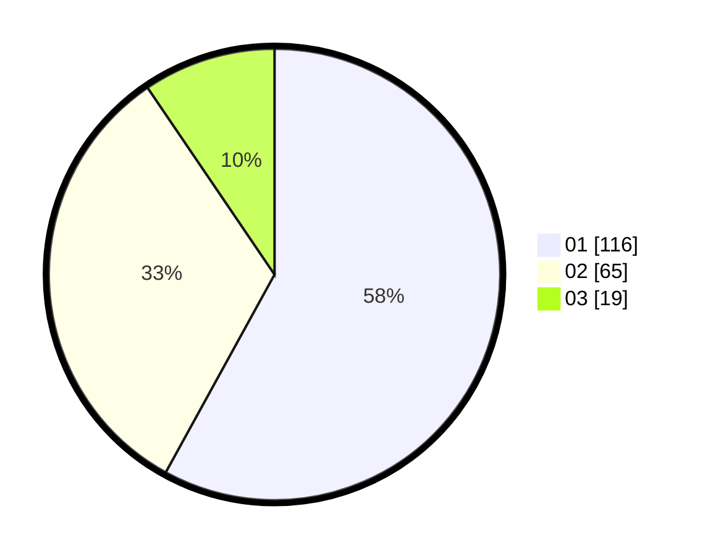

# Hasil

Hasil perolehan suara paslon dapat dilihat pada file paslon-01.txt, paslon-02.txt, dan paslon-03.txt.

Jika tidak ada, artinya data tersebut belum ada pada SIREKAP.

## Perolehan Suara

 * Paslon 01: **116**.
 * Paslon 02: **65**.
 * Paslon 03: **19**.

## Foto C Plano

https://sirekap-obj-formc.kpu.go.id/c58f/pemilu/ppwp/31/75/07/10/03/3175071003077-20240214-184818--41f9644c-ec25-4bd0-8eaa-e9e789ac65b7.jpg

https://sirekap-obj-formc.kpu.go.id/c58f/pemilu/ppwp/31/75/07/10/03/3175071003077-20240214-185856--d5248a5c-6178-400e-a479-d094a53dd3e6.jpg

https://sirekap-obj-formc.kpu.go.id/c58f/pemilu/ppwp/31/75/07/10/03/3175071003077-20240214-184843--5ab97296-9e12-4a24-908e-bf8453b4744b.jpg

## DATA PEMILIH TETAP

Jumlah pemilih dalam DPT: **202**.
 * L: **95**.
 * P: **107**.

## DATA PENGGUNA HAK PILIH

Jumlah pengguna hak pilih dalam DPT: **200**.
 * L: **95**.
 * P: **105**.

Jumlah pengguna hak pilih dalam DPTb: **0**.
 * L: **0**.
 * P: **0**.

Jumlah pengguna hak pilih dalam DPK: **2**.
 * L: **0**.
 * P: **2**.

Jumlah pengguna hak pilih: **202**.
 * L: **95**.
 * P: **107**.

## JUMLAH SUARA SAH DAN TIDAK SAH

JUMLAH SELURUH SUARA SAH: **200**.

JUMLAH SUARA TIDAK SAH: **2**.

JUMLAH SELURUH SUARA SAH DAN SUARA TIDAK SAH: **202**.
