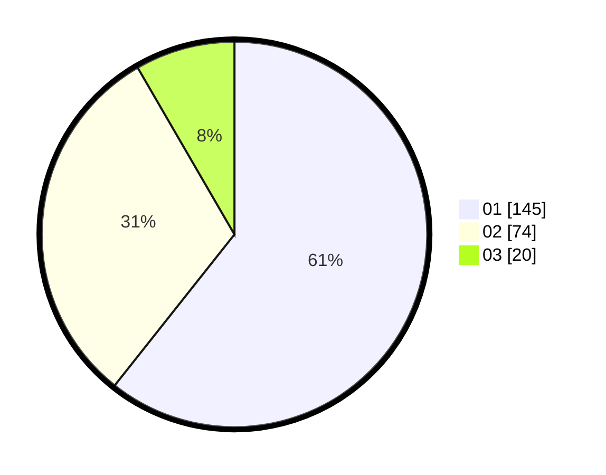

# Hasil

Hasil perolehan suara paslon dapat dilihat pada file paslon-01.txt, paslon-02.txt, dan paslon-03.txt.

Jika tidak ada, artinya data tersebut belum ada pada SIREKAP.

## Perolehan Suara

 * Paslon 01: **145**.
 * Paslon 02: **74**.
 * Paslon 03: **20**.

## Foto C Plano

https://sirekap-obj-formc.kpu.go.id/5753/pemilu/ppwp/31/75/07/10/03/3175071003082-20240214-200502--9fb11ebb-7dc6-4b4c-aba9-18a9bfb0f806.jpg

https://sirekap-obj-formc.kpu.go.id/5753/pemilu/ppwp/31/75/07/10/03/3175071003082-20240214-195553--a97a88a8-867e-4922-a56e-0bf3a843ae2c.jpg

https://sirekap-obj-formc.kpu.go.id/5753/pemilu/ppwp/31/75/07/10/03/3175071003082-20240214-185545--ae7e1663-00f8-4a94-83a5-dcd8643c3ae1.jpg
