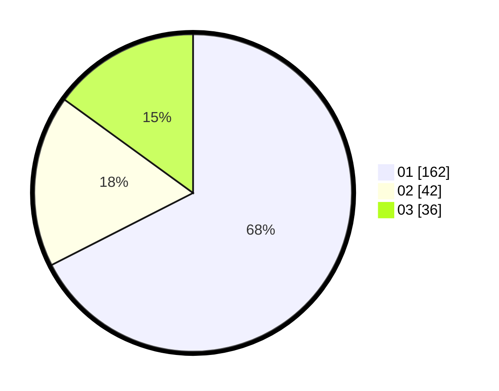

# Hasil

Hasil perolehan suara paslon dapat dilihat pada file paslon-01.txt, paslon-02.txt, dan paslon-03.txt.

Jika tidak ada, artinya data tersebut belum ada pada SIREKAP.

## Perolehan Suara

 * Paslon 01: **162**.
 * Paslon 02: **42**.
 * Paslon 03: **36**.

## Foto C Plano

https://sirekap-obj-formc.kpu.go.id/00a5/pemilu/ppwp/31/75/07/10/03/3175071003083-20240216-143453--07692880-ca97-48e9-8667-8d7c1178dff4.jpg

https://sirekap-obj-formc.kpu.go.id/00a5/pemilu/ppwp/31/75/07/10/03/3175071003083-20240216-143455--2ff83bed-6a8b-4b14-859c-61b84fc3a5e8.jpg

https://sirekap-obj-formc.kpu.go.id/00a5/pemilu/ppwp/31/75/07/10/03/3175071003083-20240216-143454--db7e0ed6-bc4f-4874-b882-bbd17534768c.jpg

## DATA PEMILIH TETAP

Jumlah pemilih dalam DPT: **297**.
 * L: **136**.
 * P: **161**.

## DATA PENGGUNA HAK PILIH

Jumlah pengguna hak pilih dalam DPT: **235**.
 * L: **103**.
 * P: **132**.

Jumlah pengguna hak pilih dalam DPTb: **5**.
 * L: **3**.
 * P: **2**.

Jumlah pengguna hak pilih dalam DPK: **2**.
 * L: **1**.
 * P: **1**.

Jumlah pengguna hak pilih: **242**.
 * L: **107**.
 * P: **135**.

## JUMLAH SUARA SAH DAN TIDAK SAH

JUMLAH SELURUH SUARA SAH: **240**.

JUMLAH SUARA TIDAK SAH: **2**.

JUMLAH SELURUH SUARA SAH DAN SUARA TIDAK SAH: **242**.
