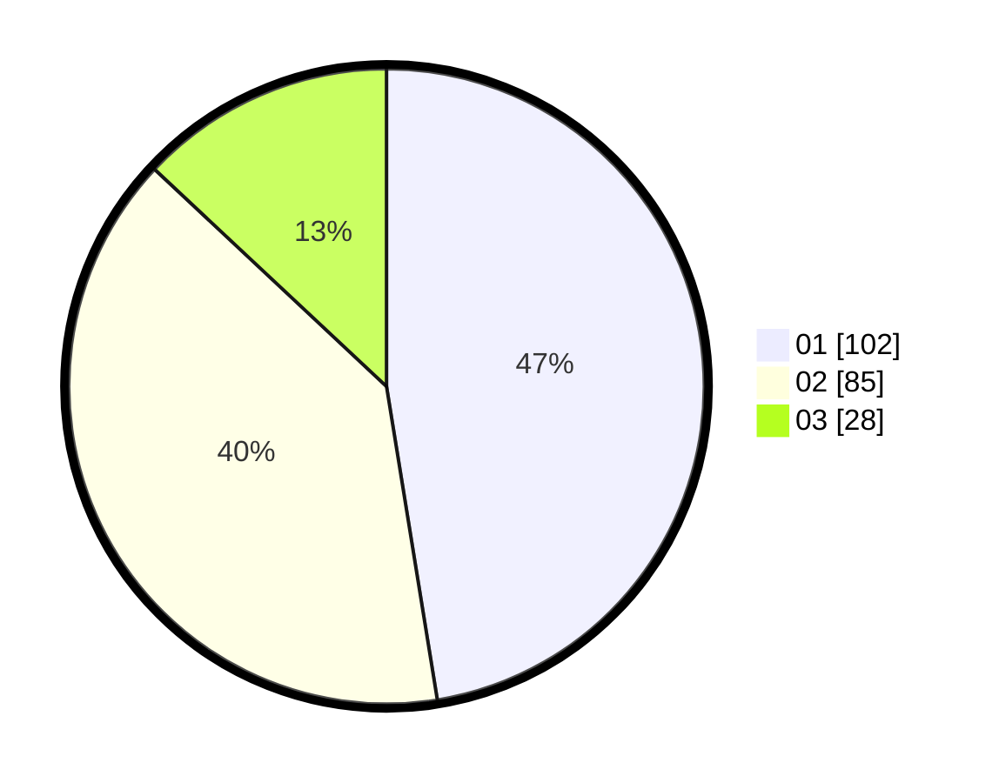

# Hasil

Hasil perolehan suara paslon dapat dilihat pada file paslon-01.txt, paslon-02.txt, dan paslon-03.txt.

Jika tidak ada, artinya data tersebut belum ada pada SIREKAP.

## Perolehan Suara

 * Paslon 01: **102**.
 * Paslon 02: **85**.
 * Paslon 03: **28**.

## Foto C Plano

https://sirekap-obj-formc.kpu.go.id/d046/pemilu/ppwp/31/75/07/10/03/3175071003085-20240215-024912--cf30b6c8-7298-4fa0-ad40-8bf7575a7b74.jpg

https://sirekap-obj-formc.kpu.go.id/d046/pemilu/ppwp/31/75/07/10/03/3175071003085-20240215-020034--eec59e0e-67b4-494a-ad7f-85b49fce48c1.jpg

https://sirekap-obj-formc.kpu.go.id/d046/pemilu/ppwp/31/75/07/10/03/3175071003085-20240215-035732--f9929bb9-f94e-413a-ba3a-c7d581da7fa9.jpg

## DATA PEMILIH TETAP

Jumlah pemilih dalam DPT: **263**.
 * L: **129**.
 * P: **134**.

## DATA PENGGUNA HAK PILIH

Jumlah pengguna hak pilih dalam DPT: **214**.
 * L: **107**.
 * P: **107**.

Jumlah pengguna hak pilih dalam DPTb: **0**.
 * L: **0**.
 * P: **0**.

Jumlah pengguna hak pilih dalam DPK: **3**.
 * L: **1**.
 * P: **2**.

Jumlah pengguna hak pilih: **217**.
 * L: **108**.
 * P: **109**.

## JUMLAH SUARA SAH DAN TIDAK SAH

JUMLAH SELURUH SUARA SAH: **215**.

JUMLAH SUARA TIDAK SAH: **2**.

JUMLAH SELURUH SUARA SAH DAN SUARA TIDAK SAH: **217**.
