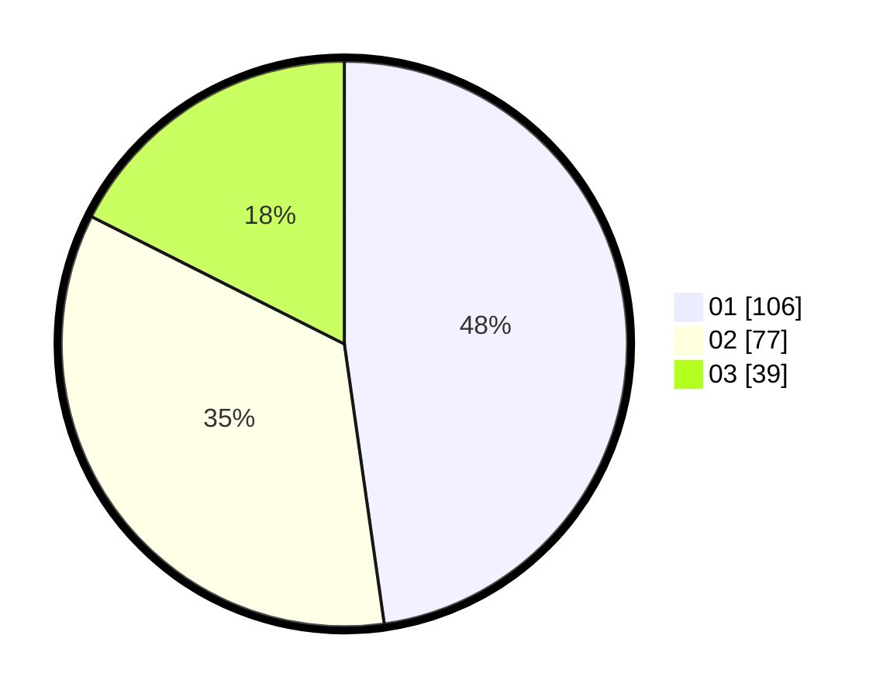

# Hasil

Hasil perolehan suara paslon dapat dilihat pada file paslon-01.txt, paslon-02.txt, dan paslon-03.txt.

Jika tidak ada, artinya data tersebut belum ada pada SIREKAP.

## Perolehan Suara

 * Paslon 01: **106**.
 * Paslon 02: **77**.
 * Paslon 03: **39**.

## Foto C Plano

https://sirekap-obj-formc.kpu.go.id/1b7e/pemilu/ppwp/31/75/07/10/03/3175071003086-20240216-045134--ac1a0f5a-fbd9-4e68-a2a1-92d202b67f1a.jpg

https://sirekap-obj-formc.kpu.go.id/1b7e/pemilu/ppwp/31/75/07/10/03/3175071003086-20240216-045136--332f6d7f-3e29-4d22-89ed-d58d1553032e.jpg

https://sirekap-obj-formc.kpu.go.id/1b7e/pemilu/ppwp/31/75/07/10/03/3175071003086-20240216-045135--ed39c5a1-3d2e-4c7d-8080-28a994cb0e41.jpg

## DATA PEMILIH TETAP

Jumlah pemilih dalam DPT: **263**.
 * L: **125**.
 * P: **138**.

## DATA PENGGUNA HAK PILIH

Jumlah pengguna hak pilih dalam DPT: **223**.
 * L: **108**.
 * P: **115**.

Jumlah pengguna hak pilih dalam DPTb: **1**.
 * L: **1**.
 * P: **0**.

Jumlah pengguna hak pilih dalam DPK: **1**.
 * L: **1**.
 * P: **0**.

Jumlah pengguna hak pilih: **225**.
 * L: **110**.
 * P: **115**.

## JUMLAH SUARA SAH DAN TIDAK SAH

JUMLAH SELURUH SUARA SAH: **222**.

JUMLAH SUARA TIDAK SAH: **3**.

JUMLAH SELURUH SUARA SAH DAN SUARA TIDAK SAH: **225**.
