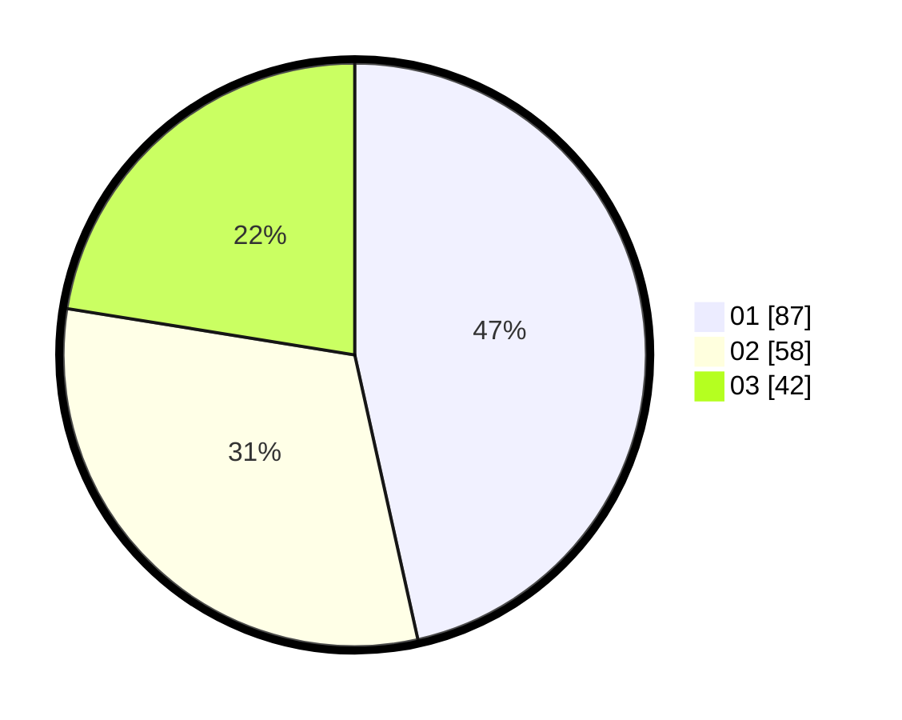

# Hasil

Hasil perolehan suara paslon dapat dilihat pada file paslon-01.txt, paslon-02.txt, dan paslon-03.txt.

Jika tidak ada, artinya data tersebut belum ada pada SIREKAP.

## Perolehan Suara

 * Paslon 01: **87**.
 * Paslon 02: **58**.
 * Paslon 03: **42**.

## Foto C Plano

https://sirekap-obj-formc.kpu.go.id/eb86/pemilu/ppwp/31/75/07/10/03/3175071003090-20240216-153012--6ef34501-6ace-4142-aa0a-0c53694626dc.jpg

https://sirekap-obj-formc.kpu.go.id/eb86/pemilu/ppwp/31/75/07/10/03/3175071003090-20240216-153014--c854329b-ddd7-4829-bd42-08ce7a02e4d9.jpg

https://sirekap-obj-formc.kpu.go.id/eb86/pemilu/ppwp/31/75/07/10/03/3175071003090-20240216-153013--93817f30-2540-4a41-8b09-08ea99bf7137.jpg

## DATA PEMILIH TETAP

Jumlah pemilih dalam DPT: **258**.
 * L: **128**.
 * P: **130**.

## DATA PENGGUNA HAK PILIH

Jumlah pengguna hak pilih dalam DPT: **184**.
 * L: **90**.
 * P: **94**.

Jumlah pengguna hak pilih dalam DPTb: **1**.
 * L: **0**.
 * P: **1**.

Jumlah pengguna hak pilih dalam DPK: **2**.
 * L: **2**.
 * P: **0**.

Jumlah pengguna hak pilih: **187**.
 * L: **92**.
 * P: **95**.

## JUMLAH SUARA SAH DAN TIDAK SAH

JUMLAH SELURUH SUARA SAH: **187**.

JUMLAH SUARA TIDAK SAH: **2**.

JUMLAH SELURUH SUARA SAH DAN SUARA TIDAK SAH: **189**.
