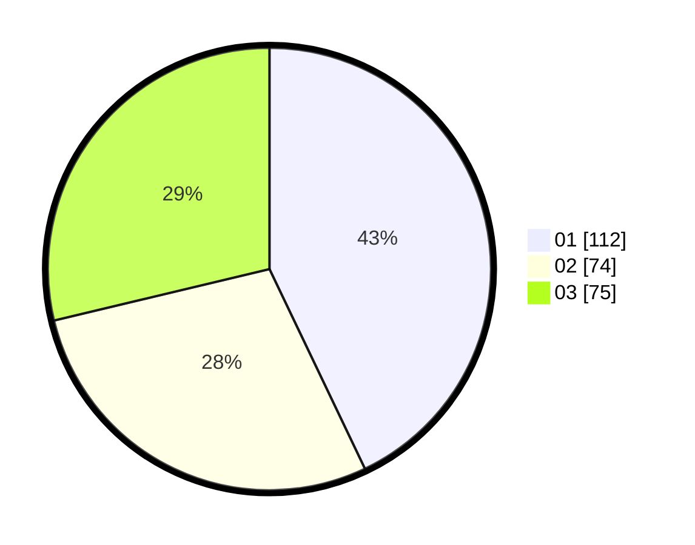

# Hasil

Hasil perolehan suara paslon dapat dilihat pada file paslon-01.txt, paslon-02.txt, dan paslon-03.txt.

Jika tidak ada, artinya data tersebut belum ada pada SIREKAP.

## Perolehan Suara

 * Paslon 01: **112**.
 * Paslon 02: **74**.
 * Paslon 03: **75**.

## Foto C Plano

https://sirekap-obj-formc.kpu.go.id/b654/pemilu/ppwp/31/75/07/10/03/3175071003099-20240214-211619--c16531b6-0600-4d00-9c03-9e3d51c00b5c.jpg

https://sirekap-obj-formc.kpu.go.id/b654/pemilu/ppwp/31/75/07/10/03/3175071003099-20240214-212858--787781a9-d7bb-4194-818d-ba44f100d7c2.jpg
