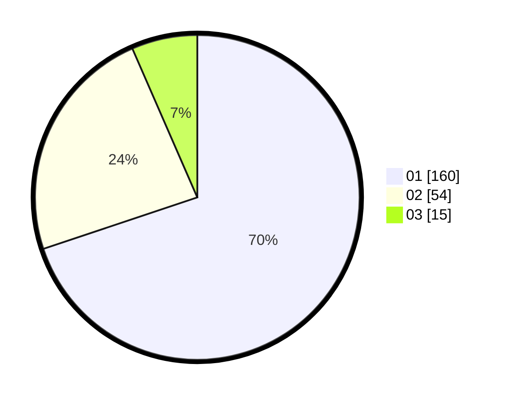

# Hasil

Hasil perolehan suara paslon dapat dilihat pada file paslon-01.txt, paslon-02.txt, dan paslon-03.txt.

Jika tidak ada, artinya data tersebut belum ada pada SIREKAP.

## Perolehan Suara

 * Paslon 01: **160**.
 * Paslon 02: **54**.
 * Paslon 03: **15**.

## Foto C Plano

https://sirekap-obj-formc.kpu.go.id/60eb/pemilu/ppwp/31/75/07/10/03/3175071003100-20240216-004700--f2e728aa-66d1-40a6-8274-c221b7c4e939.jpg

https://sirekap-obj-formc.kpu.go.id/60eb/pemilu/ppwp/31/75/07/10/03/3175071003100-20240216-004709--3cba649d-38da-4b4d-a098-da9f0988d786.jpg

https://sirekap-obj-formc.kpu.go.id/60eb/pemilu/ppwp/31/75/07/10/03/3175071003100-20240216-004705--19697afb-0acb-447d-96be-8281bc617dd5.jpg

## DATA PEMILIH TETAP

Jumlah pemilih dalam DPT: **269**.
 * L: **131**.
 * P: **138**.

## DATA PENGGUNA HAK PILIH

Jumlah pengguna hak pilih dalam DPT: **222**.
 * L: **104**.
 * P: **118**.

Jumlah pengguna hak pilih dalam DPTb: **4**.
 * L: **2**.
 * P: **2**.

Jumlah pengguna hak pilih dalam DPK: **3**.
 * L: **2**.
 * P: **1**.

Jumlah pengguna hak pilih: **229**.
 * L: **108**.
 * P: **121**.

## JUMLAH SUARA SAH DAN TIDAK SAH

JUMLAH SELURUH SUARA SAH: **229**.

JUMLAH SUARA TIDAK SAH: **0**.

JUMLAH SELURUH SUARA SAH DAN SUARA TIDAK SAH: **229**.
