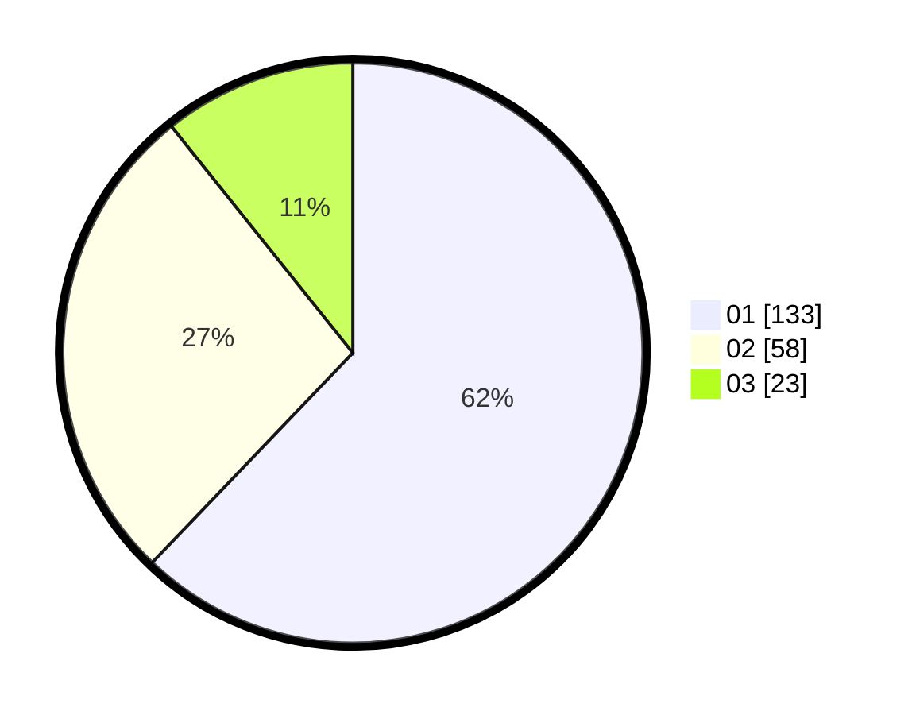

# Hasil

Hasil perolehan suara paslon dapat dilihat pada file paslon-01.txt, paslon-02.txt, dan paslon-03.txt.

Jika tidak ada, artinya data tersebut belum ada pada SIREKAP.

## Perolehan Suara

 * Paslon 01: **133**.
 * Paslon 02: **58**.
 * Paslon 03: **23**.

## Foto C Plano

https://sirekap-obj-formc.kpu.go.id/114d/pemilu/ppwp/31/75/07/10/03/3175071003101-20240214-191655--122a9151-5bba-4179-8c9c-3fa09213a142.jpg

https://sirekap-obj-formc.kpu.go.id/114d/pemilu/ppwp/31/75/07/10/03/3175071003101-20240214-192521--28ee567b-8567-4952-b26f-e9781e0f84f2.jpg

https://sirekap-obj-formc.kpu.go.id/114d/pemilu/ppwp/31/75/07/10/03/3175071003101-20240214-191908--42ed3114-f829-4aff-a5df-e4984709c78b.jpg

## DATA PEMILIH TETAP

Jumlah pemilih dalam DPT: **214**.
 * L: **92**.
 * P: **122**.

## DATA PENGGUNA HAK PILIH

Jumlah pengguna hak pilih dalam DPT: **209**.
 * L: **88**.
 * P: **121**.

Jumlah pengguna hak pilih dalam DPTb: **3**.
 * L: **2**.
 * P: **1**.

Jumlah pengguna hak pilih dalam DPK: **2**.
 * L: **2**.
 * P: **0**.

Jumlah pengguna hak pilih: **214**.
 * L: **92**.
 * P: **122**.

## JUMLAH SUARA SAH DAN TIDAK SAH

JUMLAH SELURUH SUARA SAH: **214**.

JUMLAH SUARA TIDAK SAH: **0**.

JUMLAH SELURUH SUARA SAH DAN SUARA TIDAK SAH: **214**.
