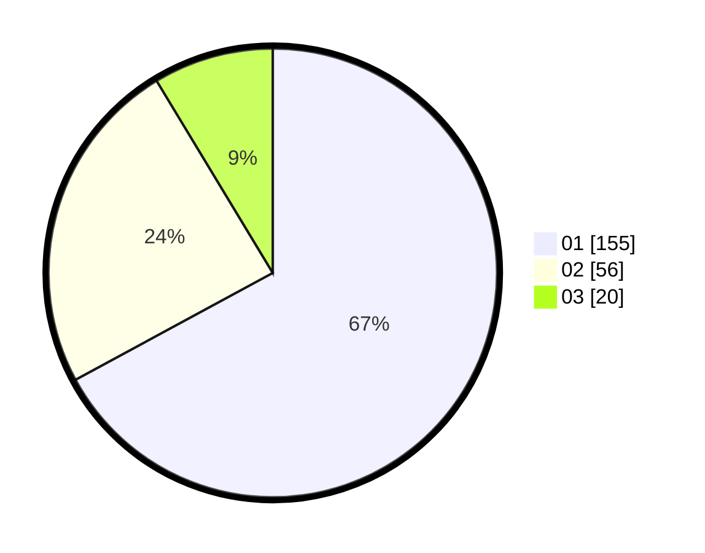

# Hasil

Hasil perolehan suara paslon dapat dilihat pada file paslon-01.txt, paslon-02.txt, dan paslon-03.txt.

Jika tidak ada, artinya data tersebut belum ada pada SIREKAP.

## Perolehan Suara

 * Paslon 01: **155**.
 * Paslon 02: **56**.
 * Paslon 03: **20**.

## Foto C Plano

https://sirekap-obj-formc.kpu.go.id/176b/pemilu/ppwp/31/75/07/10/03/3175071003104-20240216-135123--4b150028-b531-4cf7-ad55-c76f8a3651bb.jpg

https://sirekap-obj-formc.kpu.go.id/176b/pemilu/ppwp/31/75/07/10/03/3175071003104-20240216-135124--161ee39e-7dd8-45a9-929a-2def10ced2df.jpg

https://sirekap-obj-formc.kpu.go.id/176b/pemilu/ppwp/31/75/07/10/03/3175071003104-20240216-135124--0e2fb8a1-4664-48ba-b2e0-8ed51ba84e79.jpg

## DATA PEMILIH TETAP

Jumlah pemilih dalam DPT: **264**.
 * L: **127**.
 * P: **137**.

## DATA PENGGUNA HAK PILIH

Jumlah pengguna hak pilih dalam DPT: **233**.
 * L: **111**.
 * P: **122**.

Jumlah pengguna hak pilih dalam DPTb: **1**.
 * L: **1**.
 * P: **0**.

Jumlah pengguna hak pilih dalam DPK: **0**.
 * L: **0**.
 * P: **0**.

Jumlah pengguna hak pilih: **234**.
 * L: **112**.
 * P: **122**.

## JUMLAH SUARA SAH DAN TIDAK SAH

JUMLAH SELURUH SUARA SAH: **231**.

JUMLAH SUARA TIDAK SAH: **3**.

JUMLAH SELURUH SUARA SAH DAN SUARA TIDAK SAH: **234**.
