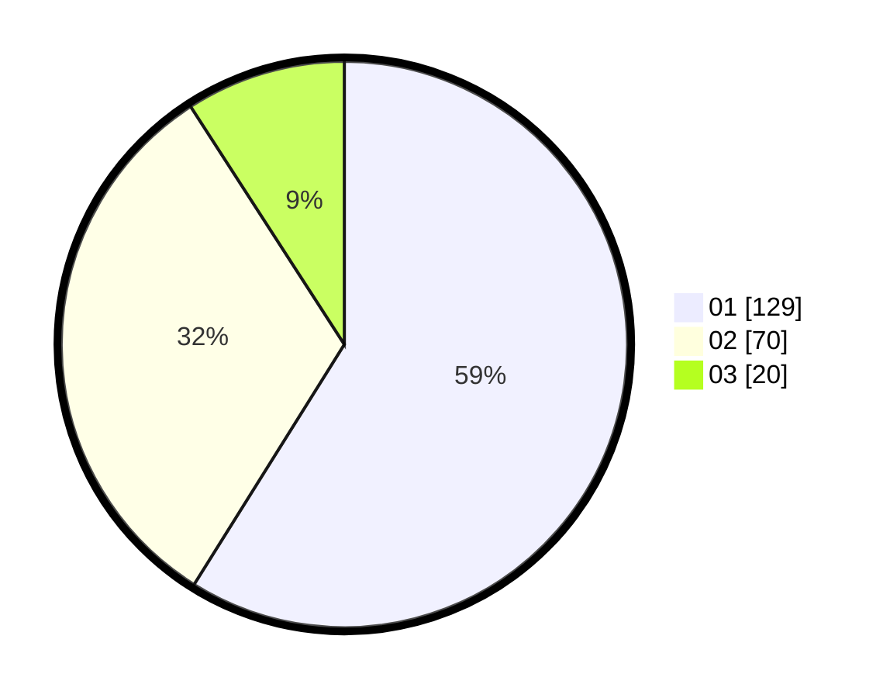

# Hasil

Hasil perolehan suara paslon dapat dilihat pada file paslon-01.txt, paslon-02.txt, dan paslon-03.txt.

Jika tidak ada, artinya data tersebut belum ada pada SIREKAP.

## Perolehan Suara

 * Paslon 01: **129**.
 * Paslon 02: **70**.
 * Paslon 03: **20**.

## Foto C Plano

https://sirekap-obj-formc.kpu.go.id/1e6f/pemilu/ppwp/31/75/07/10/03/3175071003105-20240216-142718--ab401e09-3ac2-4ba4-a259-0cf47c5a8823.jpg

https://sirekap-obj-formc.kpu.go.id/1e6f/pemilu/ppwp/31/75/07/10/03/3175071003105-20240216-142720--200988ea-a04e-4aac-b035-83efcada8502.jpg

https://sirekap-obj-formc.kpu.go.id/1e6f/pemilu/ppwp/31/75/07/10/03/3175071003105-20240216-142719--272f36fa-38b4-484d-9287-55269dfb93e3.jpg

## DATA PEMILIH TETAP

Jumlah pemilih dalam DPT: **267**.
 * L: **132**.
 * P: **135**.

## DATA PENGGUNA HAK PILIH

Jumlah pengguna hak pilih dalam DPT: **219**.
 * L: **111**.
 * P: **108**.

Jumlah pengguna hak pilih dalam DPTb: **0**.
 * L: **0**.
 * P: **0**.

Jumlah pengguna hak pilih dalam DPK: **4**.
 * L: **1**.
 * P: **3**.

Jumlah pengguna hak pilih: **223**.
 * L: **112**.
 * P: **111**.

## JUMLAH SUARA SAH DAN TIDAK SAH

JUMLAH SELURUH SUARA SAH: **219**.

JUMLAH SUARA TIDAK SAH: **4**.

JUMLAH SELURUH SUARA SAH DAN SUARA TIDAK SAH: **223**.
