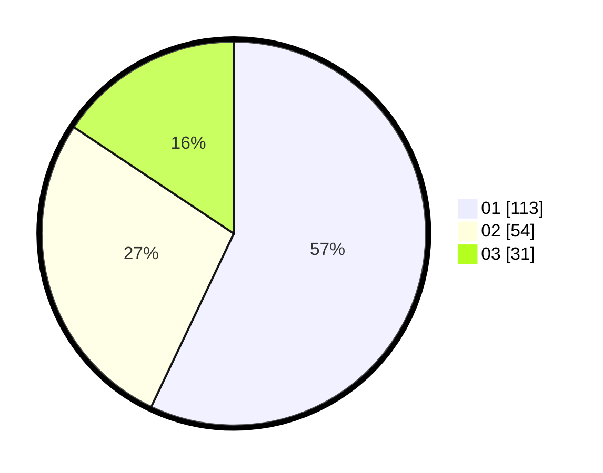

# Hasil

Hasil perolehan suara paslon dapat dilihat pada file paslon-01.txt, paslon-02.txt, dan paslon-03.txt.

Jika tidak ada, artinya data tersebut belum ada pada SIREKAP.

## Perolehan Suara

 * Paslon 01: **113**.
 * Paslon 02: **54**.
 * Paslon 03: **31**.

## Foto C Plano

https://sirekap-obj-formc.kpu.go.id/d711/pemilu/ppwp/31/75/07/10/03/3175071003107-20240216-130926--0dc8a891-5d9f-4ea0-b2f3-4fc2068d6ee1.jpg

https://sirekap-obj-formc.kpu.go.id/d711/pemilu/ppwp/31/75/07/10/03/3175071003107-20240216-130928--fe7ae4c5-f351-4fbd-84da-5ff440cdb7a6.jpg

https://sirekap-obj-formc.kpu.go.id/d711/pemilu/ppwp/31/75/07/10/03/3175071003107-20240216-130927--2b9d1647-8fff-42e3-bc88-cac8dfd5a0e2.jpg

## DATA PEMILIH TETAP

Jumlah pemilih dalam DPT: **264**.
 * L: **132**.
 * P: **132**.

## DATA PENGGUNA HAK PILIH

Jumlah pengguna hak pilih dalam DPT: **197**.
 * L: **91**.
 * P: **106**.

Jumlah pengguna hak pilih dalam DPTb: **0**.
 * L: **0**.
 * P: **0**.

Jumlah pengguna hak pilih dalam DPK: **1**.
 * L: **0**.
 * P: **1**.

Jumlah pengguna hak pilih: **198**.
 * L: **91**.
 * P: **107**.

## JUMLAH SUARA SAH DAN TIDAK SAH

JUMLAH SELURUH SUARA SAH: **198**.

JUMLAH SUARA TIDAK SAH: **0**.

JUMLAH SELURUH SUARA SAH DAN SUARA TIDAK SAH: **198**.
