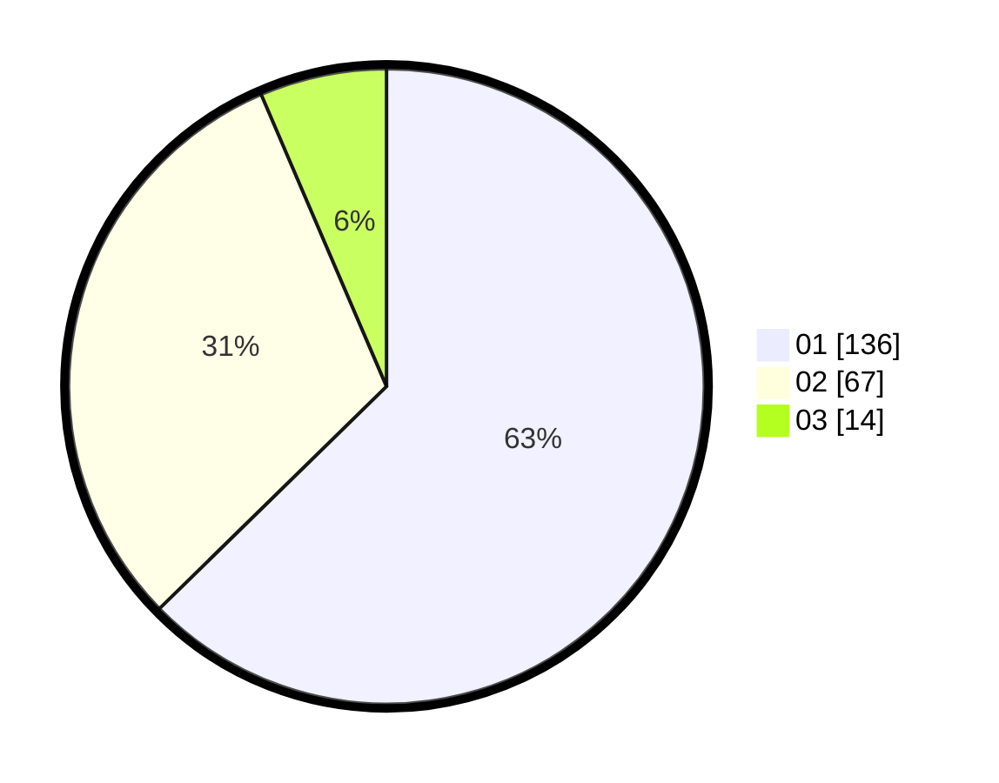

# Hasil

Hasil perolehan suara paslon dapat dilihat pada file paslon-01.txt, paslon-02.txt, dan paslon-03.txt.

Jika tidak ada, artinya data tersebut belum ada pada SIREKAP.

## Perolehan Suara

 * Paslon 01: **136**.
 * Paslon 02: **67**.
 * Paslon 03: **14**.

## Foto C Plano

https://sirekap-obj-formc.kpu.go.id/32e3/pemilu/ppwp/31/75/07/10/03/3175071003111-20240214-160154--fa65c91c-88bb-4e8b-b080-357a03b6d686.jpg

https://sirekap-obj-formc.kpu.go.id/32e3/pemilu/ppwp/31/75/07/10/03/3175071003111-20240214-192545--422f2ec4-5b59-4ea3-9574-14801e6016cf.jpg

https://sirekap-obj-formc.kpu.go.id/32e3/pemilu/ppwp/31/75/07/10/03/3175071003111-20240214-192043--9eb8d56b-9c26-4e36-ab41-7bfc10063239.jpg
