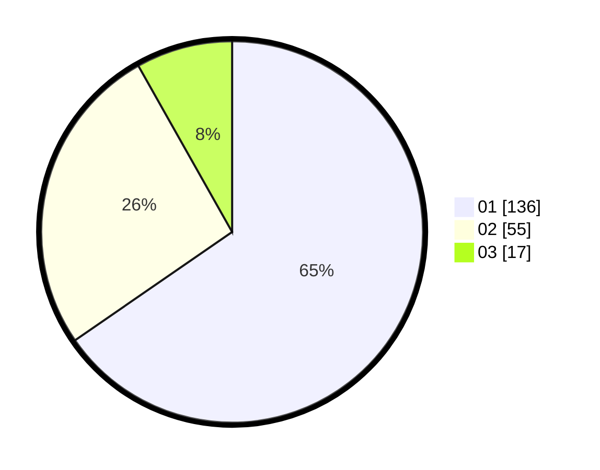

# Hasil

Hasil perolehan suara paslon dapat dilihat pada file paslon-01.txt, paslon-02.txt, dan paslon-03.txt.

Jika tidak ada, artinya data tersebut belum ada pada SIREKAP.

## Perolehan Suara

 * Paslon 01: **136**.
 * Paslon 02: **55**.
 * Paslon 03: **17**.

## Foto C Plano

https://sirekap-obj-formc.kpu.go.id/694e/pemilu/ppwp/31/75/07/10/03/3175071003113-20240216-142924--58e49d59-4701-47cb-bd4e-ba6210c28231.jpg

https://sirekap-obj-formc.kpu.go.id/694e/pemilu/ppwp/31/75/07/10/03/3175071003113-20240216-142925--d1b6cfad-6cd6-4f48-af1d-6098750c6fc8.jpg

https://sirekap-obj-formc.kpu.go.id/694e/pemilu/ppwp/31/75/07/10/03/3175071003113-20240216-142925--2b06165b-4f58-462d-877f-33b764b363c2.jpg

## DATA PEMILIH TETAP

Jumlah pemilih dalam DPT: **276**.
 * L: **141**.
 * P: **135**.

## DATA PENGGUNA HAK PILIH

Jumlah pengguna hak pilih dalam DPT: **210**.
 * L: **99**.
 * P: **111**.

Jumlah pengguna hak pilih dalam DPTb: **0**.
 * L: **0**.
 * P: **0**.

Jumlah pengguna hak pilih dalam DPK: **2**.
 * L: **1**.
 * P: **1**.

Jumlah pengguna hak pilih: **212**.
 * L: **100**.
 * P: **112**.

## JUMLAH SUARA SAH DAN TIDAK SAH

JUMLAH SELURUH SUARA SAH: **208**.

JUMLAH SUARA TIDAK SAH: **4**.

JUMLAH SELURUH SUARA SAH DAN SUARA TIDAK SAH: **212**.
