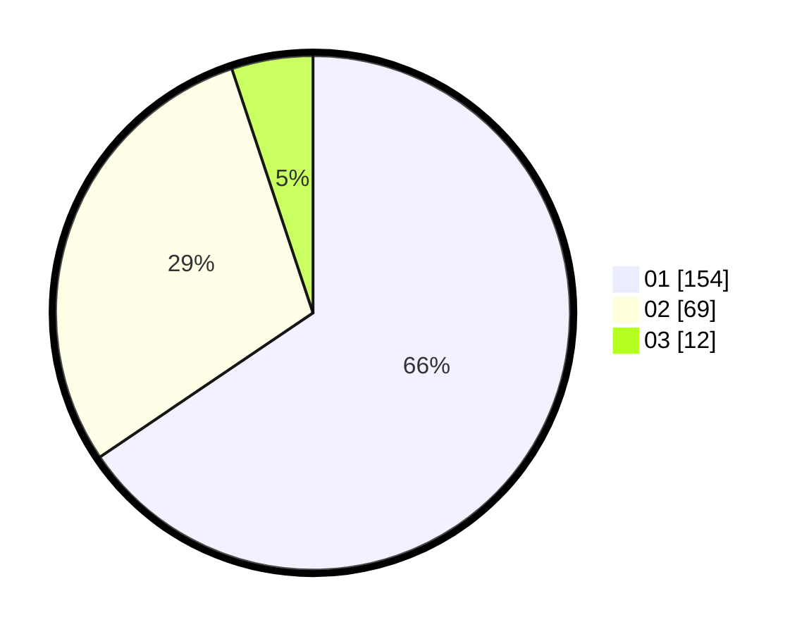

# Hasil

Hasil perolehan suara paslon dapat dilihat pada file paslon-01.txt, paslon-02.txt, dan paslon-03.txt.

Jika tidak ada, artinya data tersebut belum ada pada SIREKAP.

## Perolehan Suara

 * Paslon 01: **154**.
 * Paslon 02: **69**.
 * Paslon 03: **12**.

## Foto C Plano

https://sirekap-obj-formc.kpu.go.id/56b7/pemilu/ppwp/31/75/07/10/03/3175071003114-20240214-192918--575632a2-360e-40b9-b89b-d2a79bdd8950.jpg

https://sirekap-obj-formc.kpu.go.id/56b7/pemilu/ppwp/31/75/07/10/03/3175071003114-20240214-193036--f0183f01-a7be-480f-8dea-09738a63e2f1.jpg

https://sirekap-obj-formc.kpu.go.id/56b7/pemilu/ppwp/31/75/07/10/03/3175071003114-20240214-193109--780ae281-163f-4e91-9a0c-7ec37309724f.jpg

## DATA PEMILIH TETAP

Jumlah pemilih dalam DPT: **277**.
 * L: **140**.
 * P: **137**.

## DATA PENGGUNA HAK PILIH

Jumlah pengguna hak pilih dalam DPT: **231**.
 * L: **111**.
 * P: **120**.

Jumlah pengguna hak pilih dalam DPTb: **2**.
 * L: **1**.
 * P: **1**.

Jumlah pengguna hak pilih dalam DPK: **2**.
 * L: **1**.
 * P: **1**.

Jumlah pengguna hak pilih: **235**.
 * L: **113**.
 * P: **122**.

## JUMLAH SUARA SAH DAN TIDAK SAH

JUMLAH SELURUH SUARA SAH: **235**.

JUMLAH SUARA TIDAK SAH: **0**.

JUMLAH SELURUH SUARA SAH DAN SUARA TIDAK SAH: **235**.
