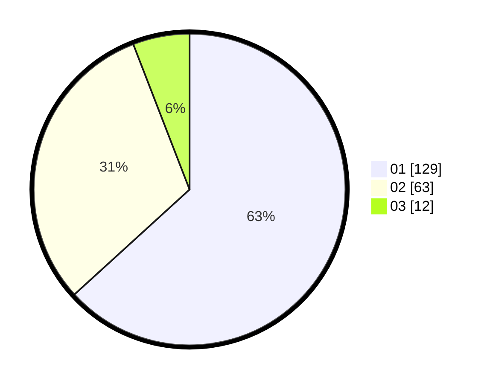

# Hasil

Hasil perolehan suara paslon dapat dilihat pada file paslon-01.txt, paslon-02.txt, dan paslon-03.txt.

Jika tidak ada, artinya data tersebut belum ada pada SIREKAP.

## Perolehan Suara

 * Paslon 01: **129**.
 * Paslon 02: **63**.
 * Paslon 03: **12**.

## Foto C Plano

https://sirekap-obj-formc.kpu.go.id/c3fb/pemilu/ppwp/31/75/07/10/03/3175071003115-20240214-160059--0cb89370-3d5c-4a63-bc0a-bad0f49ff7ee.jpg

https://sirekap-obj-formc.kpu.go.id/c3fb/pemilu/ppwp/31/75/07/10/03/3175071003115-20240214-160118--fb60a219-fe89-4ad8-83a7-13e92bd31d0b.jpg

https://sirekap-obj-formc.kpu.go.id/c3fb/pemilu/ppwp/31/75/07/10/03/3175071003115-20240216-180106--e27fe9cf-2fa9-4072-af0a-27c451a6b8f5.jpg

## DATA PEMILIH TETAP

Jumlah pemilih dalam DPT: **279**.
 * L: **138**.
 * P: **141**.

## DATA PENGGUNA HAK PILIH

Jumlah pengguna hak pilih dalam DPT: **203**.
 * L: **97**.
 * P: **106**.

Jumlah pengguna hak pilih dalam DPTb: **0**.
 * L: **0**.
 * P: **0**.

Jumlah pengguna hak pilih dalam DPK: **1**.
 * L: **0**.
 * P: **1**.

Jumlah pengguna hak pilih: **204**.
 * L: **97**.
 * P: **107**.

## JUMLAH SUARA SAH DAN TIDAK SAH

JUMLAH SELURUH SUARA SAH: **204**.

JUMLAH SUARA TIDAK SAH: **0**.

JUMLAH SELURUH SUARA SAH DAN SUARA TIDAK SAH: **204**.
