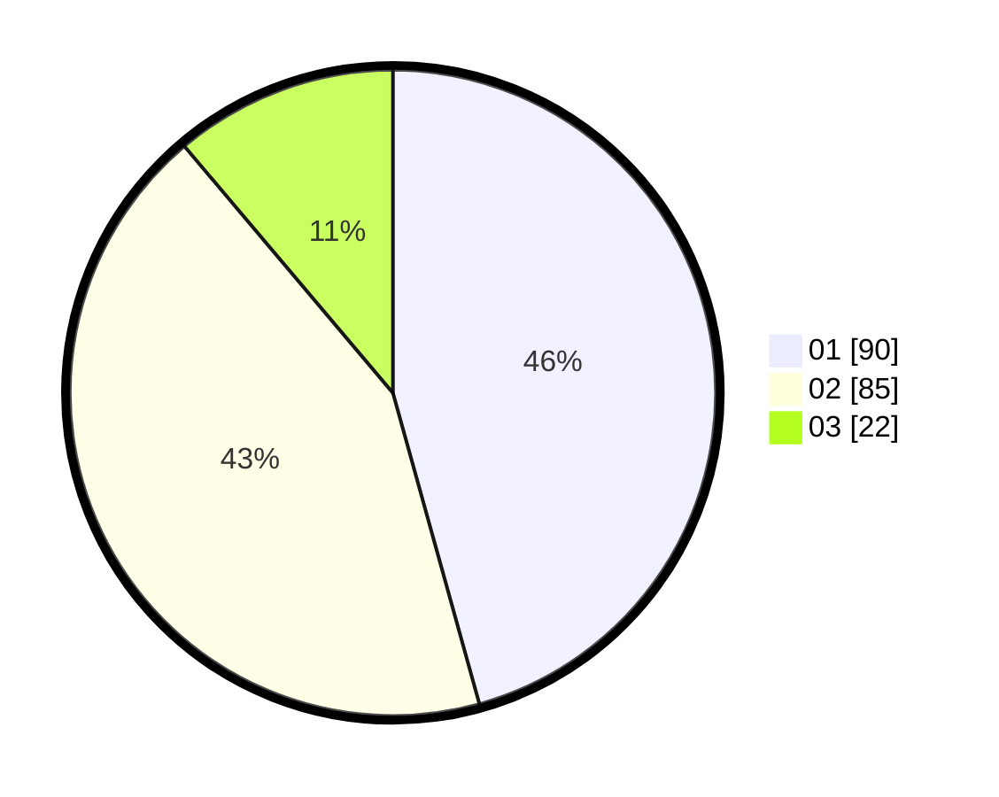

# Hasil

Hasil perolehan suara paslon dapat dilihat pada file paslon-01.txt, paslon-02.txt, dan paslon-03.txt.

Jika tidak ada, artinya data tersebut belum ada pada SIREKAP.

## Perolehan Suara

 * Paslon 01: **90**.
 * Paslon 02: **85**.
 * Paslon 03: **22**.

## Foto C Plano

https://sirekap-obj-formc.kpu.go.id/12f3/pemilu/ppwp/31/75/07/10/03/3175071003117-20240215-033522--0314ad08-f0d4-43c6-8525-6f969681fd6a.jpg

https://sirekap-obj-formc.kpu.go.id/12f3/pemilu/ppwp/31/75/07/10/03/3175071003117-20240215-033627--a1d5ce37-5ac6-48a7-82c5-81530be5ba83.jpg

https://sirekap-obj-formc.kpu.go.id/12f3/pemilu/ppwp/31/75/07/10/03/3175071003117-20240215-033714--c7984525-73a0-4b75-9d02-b4077636c731.jpg

## DATA PEMILIH TETAP

Jumlah pemilih dalam DPT: **279**.
 * L: **147**.
 * P: **138**.

## DATA PENGGUNA HAK PILIH

Jumlah pengguna hak pilih dalam DPT: **199**.
 * L: **98**.
 * P: **101**.

Jumlah pengguna hak pilih dalam DPTb: **0**.
 * L: **0**.
 * P: **0**.

Jumlah pengguna hak pilih dalam DPK: **1**.
 * L: **0**.
 * P: **1**.

Jumlah pengguna hak pilih: **200**.
 * L: **98**.
 * P: **102**.

## JUMLAH SUARA SAH DAN TIDAK SAH

JUMLAH SELURUH SUARA SAH: **197**.

JUMLAH SUARA TIDAK SAH: **3**.

JUMLAH SELURUH SUARA SAH DAN SUARA TIDAK SAH: **200**.
