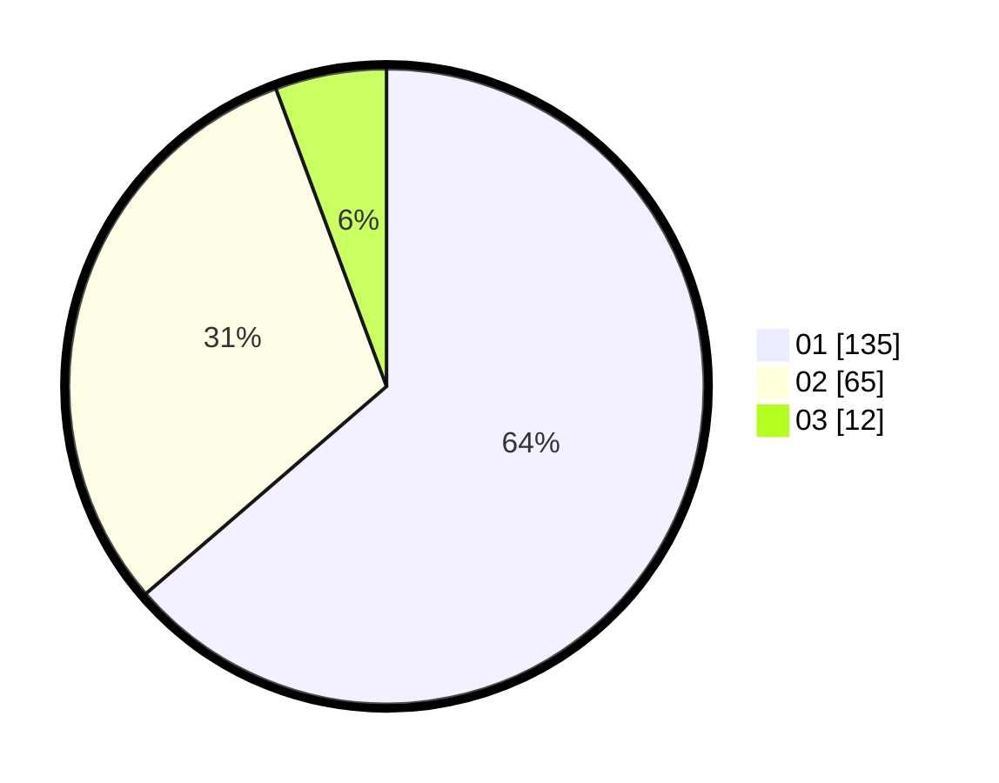

# Hasil

Hasil perolehan suara paslon dapat dilihat pada file paslon-01.txt, paslon-02.txt, dan paslon-03.txt.

Jika tidak ada, artinya data tersebut belum ada pada SIREKAP.

## Perolehan Suara

 * Paslon 01: **135**.
 * Paslon 02: **65**.
 * Paslon 03: **12**.

## Foto C Plano

https://sirekap-obj-formc.kpu.go.id/fba5/pemilu/ppwp/31/75/07/10/03/3175071003122-20240216-150547--70c86e05-5efc-405f-9cd3-a86362bc079f.jpg

https://sirekap-obj-formc.kpu.go.id/fba5/pemilu/ppwp/31/75/07/10/03/3175071003122-20240216-150548--53c75dc9-4c7f-450e-bbd9-d125a14c19f1.jpg

https://sirekap-obj-formc.kpu.go.id/fba5/pemilu/ppwp/31/75/07/10/03/3175071003122-20240216-150547--25845a55-1374-4883-bb14-434935ea287d.jpg

## DATA PEMILIH TETAP

Jumlah pemilih dalam DPT: **285**.
 * L: **142**.
 * P: **143**.

## DATA PENGGUNA HAK PILIH

Jumlah pengguna hak pilih dalam DPT: **210**.
 * L: **97**.
 * P: **113**.

Jumlah pengguna hak pilih dalam DPTb: **1**.
 * L: **0**.
 * P: **1**.

Jumlah pengguna hak pilih dalam DPK: **1**.
 * L: **1**.
 * P: **0**.

Jumlah pengguna hak pilih: **212**.
 * L: **98**.
 * P: **114**.

## JUMLAH SUARA SAH DAN TIDAK SAH

JUMLAH SELURUH SUARA SAH: **212**.

JUMLAH SUARA TIDAK SAH: **0**.

JUMLAH SELURUH SUARA SAH DAN SUARA TIDAK SAH: **212**.
