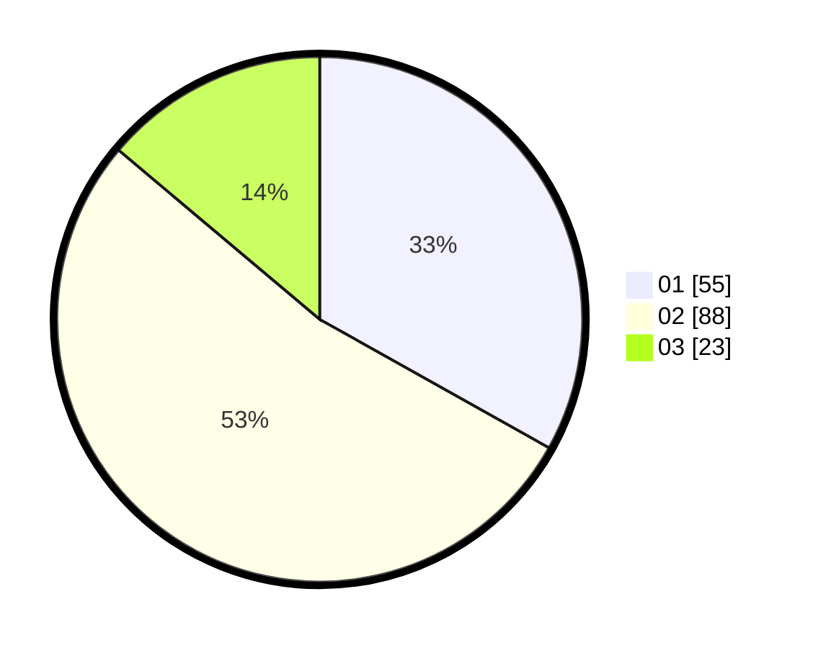

# Hasil

Hasil perolehan suara paslon dapat dilihat pada file paslon-01.txt, paslon-02.txt, dan paslon-03.txt.

Jika tidak ada, artinya data tersebut belum ada pada SIREKAP.

## Perolehan Suara

 * Paslon 01: **55**.
 * Paslon 02: **88**.
 * Paslon 03: **23**.

## Foto C Plano

https://sirekap-obj-formc.kpu.go.id/c4c2/pemilu/ppwp/31/75/07/10/03/3175071003127-20240215-003522--bbe20a58-44d9-4a61-9c5d-100fc2d3ceb4.jpg

https://sirekap-obj-formc.kpu.go.id/c4c2/pemilu/ppwp/31/75/07/10/03/3175071003127-20240215-003627--f534cb10-a6d0-4b0f-b99e-c6f339df32bd.jpg

https://sirekap-obj-formc.kpu.go.id/c4c2/pemilu/ppwp/31/75/07/10/03/3175071003127-20240215-003709--6522fb74-34b6-45c1-ad6e-2613433a0570.jpg
