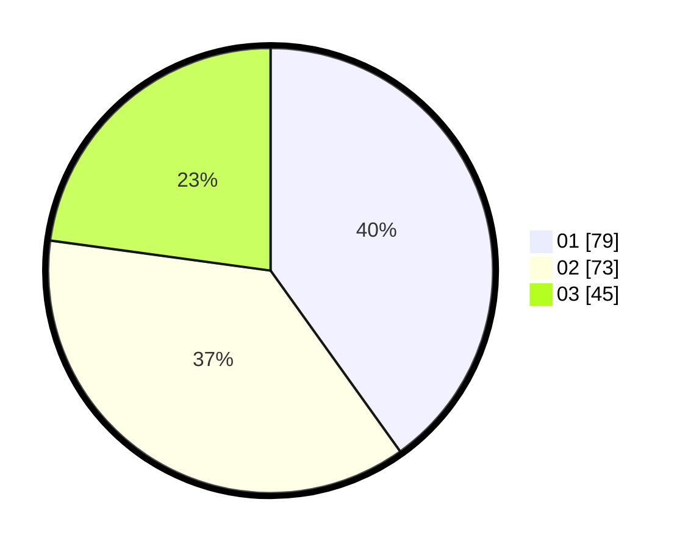

# Hasil

Hasil perolehan suara paslon dapat dilihat pada file paslon-01.txt, paslon-02.txt, dan paslon-03.txt.

Jika tidak ada, artinya data tersebut belum ada pada SIREKAP.

## Perolehan Suara

 * Paslon 01: **79**.
 * Paslon 02: **73**.
 * Paslon 03: **45**.

## Foto C Plano

https://sirekap-obj-formc.kpu.go.id/8607/pemilu/ppwp/31/75/07/10/03/3175071003130-20240216-092238--f1d2c5f2-1769-42b3-983c-c0b323a23780.jpg

https://sirekap-obj-formc.kpu.go.id/8607/pemilu/ppwp/31/75/07/10/03/3175071003130-20240216-091232--e4d95987-25f0-4b80-b246-e435cdfe4b46.jpg

https://sirekap-obj-formc.kpu.go.id/8607/pemilu/ppwp/31/75/07/10/03/3175071003130-20240216-091231--82da3879-efea-483c-ac43-91e2a0ab7cbd.jpg

## DATA PEMILIH TETAP

Jumlah pemilih dalam DPT: **248**.
 * L: **138**.
 * P: **141**.

## DATA PENGGUNA HAK PILIH

Jumlah pengguna hak pilih dalam DPT: **279**.
 * L: **138**.
 * P: **141**.

Jumlah pengguna hak pilih dalam DPTb: **3**.
 * L: **0**.
 * P: **3**.

Jumlah pengguna hak pilih dalam DPK: **2**.
 * L: **1**.
 * P: **1**.

Jumlah pengguna hak pilih: **284**.
 * L: **139**.
 * P: **145**.

## JUMLAH SUARA SAH DAN TIDAK SAH

JUMLAH SELURUH SUARA SAH: **179**.

JUMLAH SUARA TIDAK SAH: **3**.

JUMLAH SELURUH SUARA SAH DAN SUARA TIDAK SAH: **202**.
