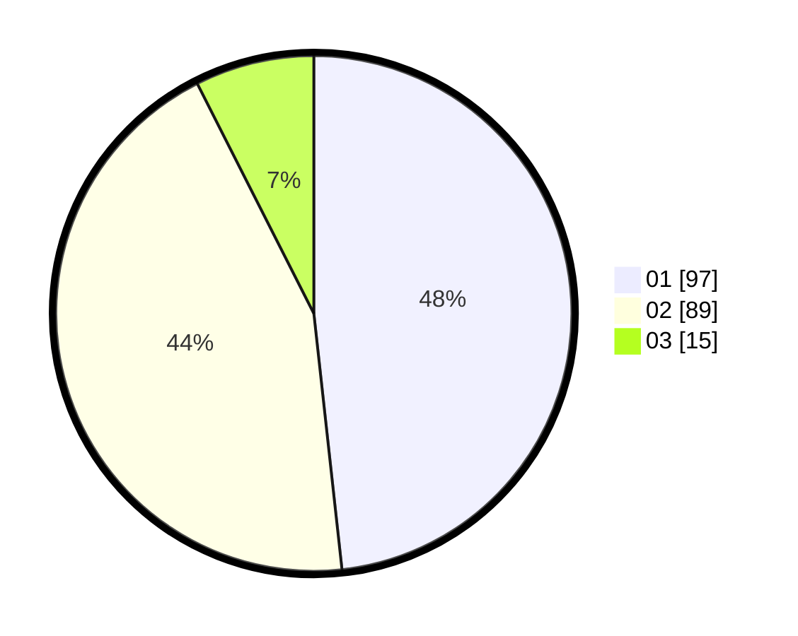

# Hasil

Hasil perolehan suara paslon dapat dilihat pada file paslon-01.txt, paslon-02.txt, dan paslon-03.txt.

Jika tidak ada, artinya data tersebut belum ada pada SIREKAP.

## Perolehan Suara

 * Paslon 01: **97**.
 * Paslon 02: **89**.
 * Paslon 03: **15**.

## Foto C Plano

https://sirekap-obj-formc.kpu.go.id/caf5/pemilu/ppwp/31/75/07/10/03/3175071003131-20240214-234747--ad639369-7ece-459d-8c18-94c7a3837d79.jpg

https://sirekap-obj-formc.kpu.go.id/caf5/pemilu/ppwp/31/75/07/10/03/3175071003131-20240214-234831--de23fb94-4779-43ab-bcef-b88acdf2c560.jpg

https://sirekap-obj-formc.kpu.go.id/caf5/pemilu/ppwp/31/75/07/10/03/3175071003131-20240214-234909--1ef857cf-3a86-4852-be69-3d9c5de4e35f.jpg
