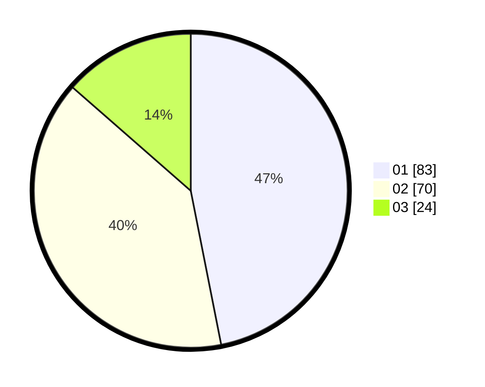

# Hasil

Hasil perolehan suara paslon dapat dilihat pada file paslon-01.txt, paslon-02.txt, dan paslon-03.txt.

Jika tidak ada, artinya data tersebut belum ada pada SIREKAP.

## Perolehan Suara

 * Paslon 01: **83**.
 * Paslon 02: **70**.
 * Paslon 03: **24**.

## Foto C Plano

https://sirekap-obj-formc.kpu.go.id/8a5a/pemilu/ppwp/31/75/07/10/03/3175071003134-20240214-201524--6f9c956e-2028-4b51-b71d-389682babe36.jpg

https://sirekap-obj-formc.kpu.go.id/8a5a/pemilu/ppwp/31/75/07/10/03/3175071003134-20240214-191215--dc7a7d7c-e5cb-4677-b2e9-6b2dc31546cb.jpg

https://sirekap-obj-formc.kpu.go.id/8a5a/pemilu/ppwp/31/75/07/10/03/3175071003134-20240214-193812--1fb93e6e-d243-41a6-8b24-611d4c0fea7f.jpg

## DATA PEMILIH TETAP

Jumlah pemilih dalam DPT: **279**.
 * L: **143**.
 * P: **136**.

## DATA PENGGUNA HAK PILIH

Jumlah pengguna hak pilih dalam DPT: **178**.
 * L: **89**.
 * P: **89**.

Jumlah pengguna hak pilih dalam DPTb: **0**.
 * L: **0**.
 * P: **0**.

Jumlah pengguna hak pilih dalam DPK: **2**.
 * L: **1**.
 * P: **1**.

Jumlah pengguna hak pilih: **180**.
 * L: **90**.
 * P: **90**.

## JUMLAH SUARA SAH DAN TIDAK SAH

JUMLAH SELURUH SUARA SAH: **177**.

JUMLAH SUARA TIDAK SAH: **3**.

JUMLAH SELURUH SUARA SAH DAN SUARA TIDAK SAH: **180**.
