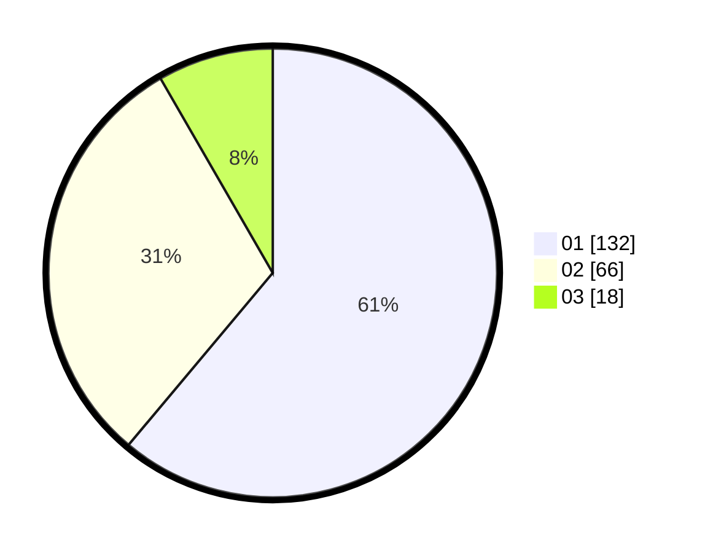

# Hasil

Hasil perolehan suara paslon dapat dilihat pada file paslon-01.txt, paslon-02.txt, dan paslon-03.txt.

Jika tidak ada, artinya data tersebut belum ada pada SIREKAP.

## Perolehan Suara

 * Paslon 01: **132**.
 * Paslon 02: **66**.
 * Paslon 03: **18**.

## Foto C Plano

https://sirekap-obj-formc.kpu.go.id/3e2d/pemilu/ppwp/31/75/07/10/03/3175071003136-20240215-015830--a580fc0f-e2bf-4d45-8f8e-36eb37c7535b.jpg

https://sirekap-obj-formc.kpu.go.id/3e2d/pemilu/ppwp/31/75/07/10/03/3175071003136-20240215-020142--f16aa445-1d01-41b1-85bf-0bb437ba2f4c.jpg

https://sirekap-obj-formc.kpu.go.id/3e2d/pemilu/ppwp/31/75/07/10/03/3175071003136-20240214-211747--086c1835-d8a6-4715-b996-750e2a24aaaa.jpg
