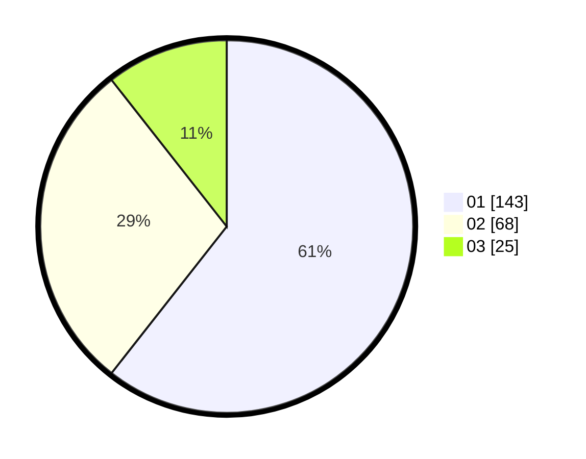

# Hasil

Hasil perolehan suara paslon dapat dilihat pada file paslon-01.txt, paslon-02.txt, dan paslon-03.txt.

Jika tidak ada, artinya data tersebut belum ada pada SIREKAP.

## Perolehan Suara

 * Paslon 01: **143**.
 * Paslon 02: **68**.
 * Paslon 03: **25**.

## Foto C Plano

https://sirekap-obj-formc.kpu.go.id/cb44/pemilu/ppwp/31/75/07/10/03/3175071003138-20240214-155317--c49c2977-0870-4ab7-82d4-b56492314aab.jpg

https://sirekap-obj-formc.kpu.go.id/cb44/pemilu/ppwp/31/75/07/10/03/3175071003138-20240214-155550--6b1d7bf3-24cd-45ed-b089-a212c267a25f.jpg

https://sirekap-obj-formc.kpu.go.id/cb44/pemilu/ppwp/31/75/07/10/03/3175071003138-20240214-155645--469f8735-03ce-4142-a8b4-029b2c87e594.jpg

## DATA PEMILIH TETAP

Jumlah pemilih dalam DPT: **281**.
 * L: **146**.
 * P: **135**.

## DATA PENGGUNA HAK PILIH

Jumlah pengguna hak pilih dalam DPT: **236**.
 * L: **119**.
 * P: **117**.

Jumlah pengguna hak pilih dalam DPTb: **1**.
 * L: **1**.
 * P: **0**.

Jumlah pengguna hak pilih dalam DPK: **4**.
 * L: **2**.
 * P: **2**.

Jumlah pengguna hak pilih: **241**.
 * L: **122**.
 * P: **119**.

## JUMLAH SUARA SAH DAN TIDAK SAH

JUMLAH SELURUH SUARA SAH: **236**.

JUMLAH SUARA TIDAK SAH: **5**.

JUMLAH SELURUH SUARA SAH DAN SUARA TIDAK SAH: **241**.
