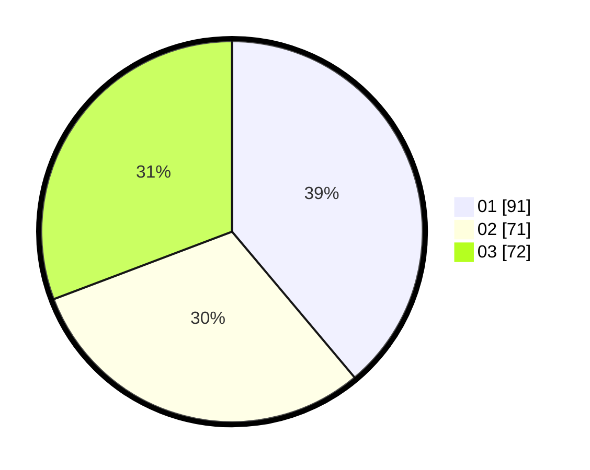

# Hasil

Hasil perolehan suara paslon dapat dilihat pada file paslon-01.txt, paslon-02.txt, dan paslon-03.txt.

Jika tidak ada, artinya data tersebut belum ada pada SIREKAP.

## Perolehan Suara

 * Paslon 01: **91**.
 * Paslon 02: **71**.
 * Paslon 03: **72**.

## Foto C Plano

https://sirekap-obj-formc.kpu.go.id/405d/pemilu/ppwp/31/75/07/10/03/3175071003142-20240214-193017--0ee2b7b3-3360-458f-a12b-1cf3869fd88e.jpg

https://sirekap-obj-formc.kpu.go.id/405d/pemilu/ppwp/31/75/07/10/03/3175071003142-20240214-193244--6308b2a3-a7aa-4ce6-859b-9ec2ebe4b5ed.jpg

https://sirekap-obj-formc.kpu.go.id/405d/pemilu/ppwp/31/75/07/10/03/3175071003142-20240214-193531--9664b2f1-ce41-420b-944b-d9147bacbc8d.jpg

## DATA PEMILIH TETAP

Jumlah pemilih dalam DPT: **279**.
 * L: **122**.
 * P: **157**.

## DATA PENGGUNA HAK PILIH

Jumlah pengguna hak pilih dalam DPT: **236**.
 * L: **101**.
 * P: **135**.

Jumlah pengguna hak pilih dalam DPTb: **5**.
 * L: **3**.
 * P: **2**.

Jumlah pengguna hak pilih dalam DPK: **0**.
 * L: **0**.
 * P: **0**.

Jumlah pengguna hak pilih: **241**.
 * L: **104**.
 * P: **137**.

## JUMLAH SUARA SAH DAN TIDAK SAH

JUMLAH SELURUH SUARA SAH: **234**.

JUMLAH SUARA TIDAK SAH: **7**.

JUMLAH SELURUH SUARA SAH DAN SUARA TIDAK SAH: **241**.
