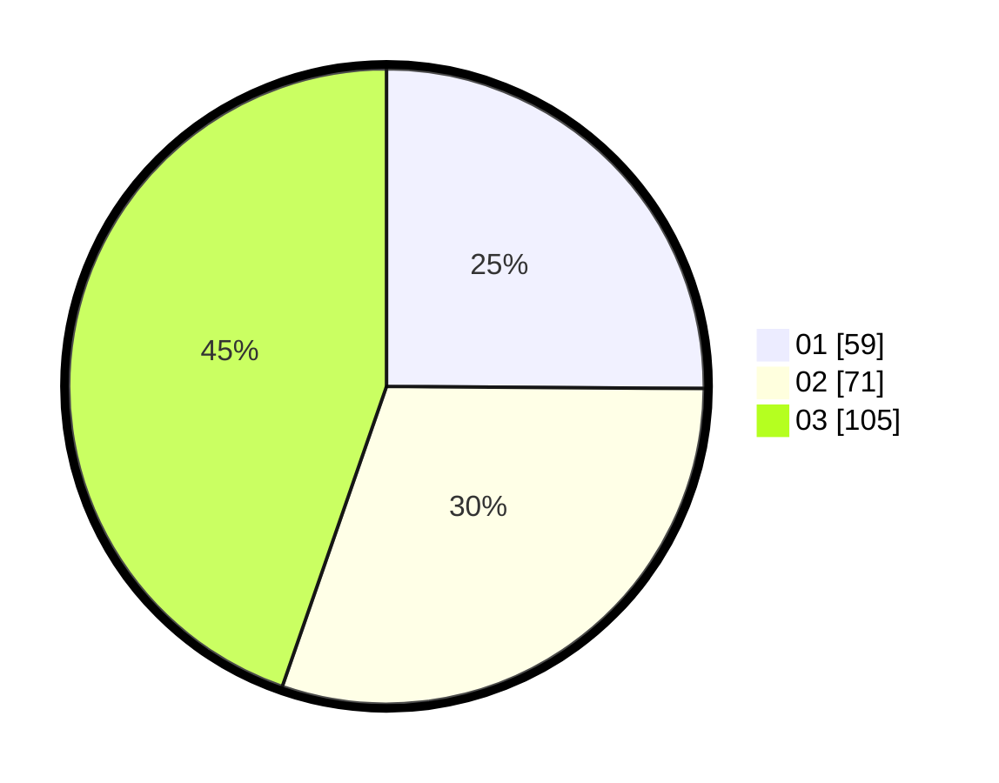

# Hasil

Hasil perolehan suara paslon dapat dilihat pada file paslon-01.txt, paslon-02.txt, dan paslon-03.txt.

Jika tidak ada, artinya data tersebut belum ada pada SIREKAP.

## Perolehan Suara

 * Paslon 01: **59**.
 * Paslon 02: **71**.
 * Paslon 03: **105**.

## Foto C Plano

https://sirekap-obj-formc.kpu.go.id/485e/pemilu/ppwp/31/75/07/10/03/3175071003145-20240216-102745--06f7280a-1304-40de-a36d-6143a0fb27d0.jpg

https://sirekap-obj-formc.kpu.go.id/485e/pemilu/ppwp/31/75/07/10/03/3175071003145-20240216-102748--614ebe39-cdc2-4b19-a9cf-95024a1e42c9.jpg

https://sirekap-obj-formc.kpu.go.id/485e/pemilu/ppwp/31/75/07/10/03/3175071003145-20240216-102746--ba924ab3-da97-4020-adab-56e196078c1b.jpg

## DATA PEMILIH TETAP

Jumlah pemilih dalam DPT: **269**.
 * L: **126**.
 * P: **143**.

## DATA PENGGUNA HAK PILIH

Jumlah pengguna hak pilih dalam DPT: **228**.
 * L: **104**.
 * P: **124**.

Jumlah pengguna hak pilih dalam DPTb: **7**.
 * L: **3**.
 * P: **4**.

Jumlah pengguna hak pilih dalam DPK: **2**.
 * L: **1**.
 * P: **1**.

Jumlah pengguna hak pilih: **237**.
 * L: **108**.
 * P: **129**.

## JUMLAH SUARA SAH DAN TIDAK SAH

JUMLAH SELURUH SUARA SAH: **235**.

JUMLAH SUARA TIDAK SAH: **2**.

JUMLAH SELURUH SUARA SAH DAN SUARA TIDAK SAH: **237**.
