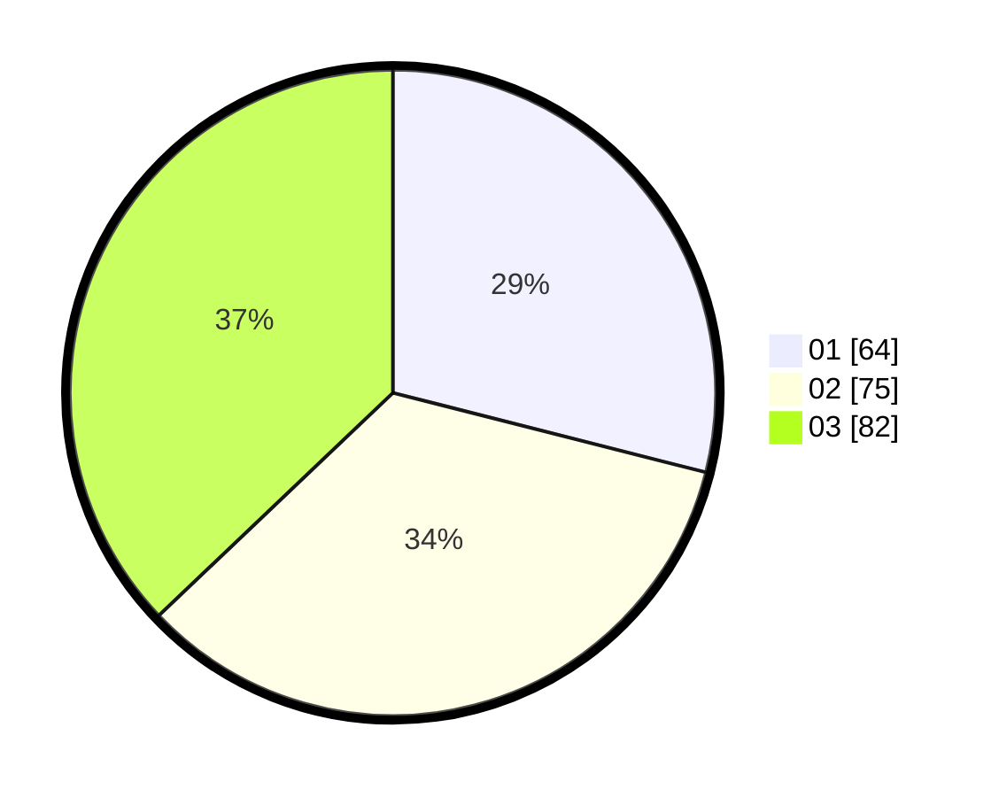

# Hasil

Hasil perolehan suara paslon dapat dilihat pada file paslon-01.txt, paslon-02.txt, dan paslon-03.txt.

Jika tidak ada, artinya data tersebut belum ada pada SIREKAP.

## Perolehan Suara

 * Paslon 01: **64**.
 * Paslon 02: **75**.
 * Paslon 03: **82**.

## Foto C Plano

https://sirekap-obj-formc.kpu.go.id/e660/pemilu/ppwp/31/75/07/10/03/3175071003147-20240216-035512--cbeb9b8d-0c3c-4cf5-a4ae-f951b15ae6b7.jpg

https://sirekap-obj-formc.kpu.go.id/e660/pemilu/ppwp/31/75/07/10/03/3175071003147-20240216-034644--525e218e-03cd-4bbd-bab9-a81a21c30a92.jpg

https://sirekap-obj-formc.kpu.go.id/e660/pemilu/ppwp/31/75/07/10/03/3175071003147-20240216-034642--55e98344-949b-4ec3-be6b-bc45086b2afa.jpg

## DATA PEMILIH TETAP

Jumlah pemilih dalam DPT: **267**.
 * L: **118**.
 * P: **149**.

## DATA PENGGUNA HAK PILIH

Jumlah pengguna hak pilih dalam DPT: **211**.
 * L: **85**.
 * P: **126**.

Jumlah pengguna hak pilih dalam DPTb: **11**.
 * L: **6**.
 * P: **5**.

Jumlah pengguna hak pilih dalam DPK: **2**.
 * L: **0**.
 * P: **2**.

Jumlah pengguna hak pilih: **224**.
 * L: **91**.
 * P: **133**.

## JUMLAH SUARA SAH DAN TIDAK SAH

JUMLAH SELURUH SUARA SAH: **221**.

JUMLAH SUARA TIDAK SAH: **3**.

JUMLAH SELURUH SUARA SAH DAN SUARA TIDAK SAH: **224**.
