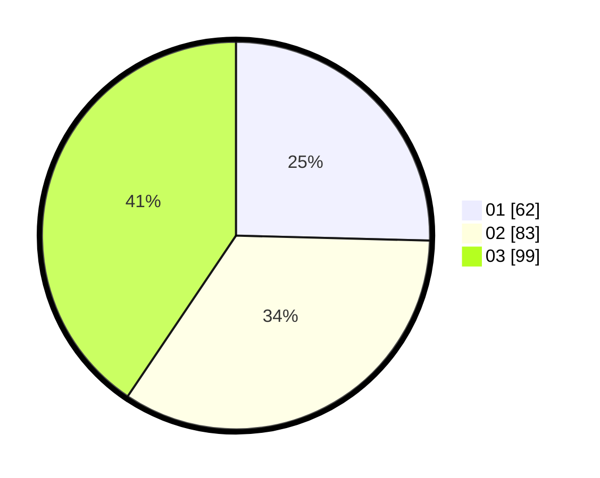

# Hasil

Hasil perolehan suara paslon dapat dilihat pada file paslon-01.txt, paslon-02.txt, dan paslon-03.txt.

Jika tidak ada, artinya data tersebut belum ada pada SIREKAP.

## Perolehan Suara

 * Paslon 01: **62**.
 * Paslon 02: **83**.
 * Paslon 03: **99**.

## Foto C Plano

https://sirekap-obj-formc.kpu.go.id/46b2/pemilu/ppwp/31/75/07/10/03/3175071003150-20240214-160136--0653cf06-31f7-450e-b806-c082d91f2e11.jpg

https://sirekap-obj-formc.kpu.go.id/46b2/pemilu/ppwp/31/75/07/10/03/3175071003150-20240216-055710--386e9608-3840-4393-bb96-1b039ec5ebd8.jpg

https://sirekap-obj-formc.kpu.go.id/46b2/pemilu/ppwp/31/75/07/10/03/3175071003150-20240216-055709--ffe47044-b280-482c-8573-8e0e8a353bc4.jpg

## DATA PEMILIH TETAP

Jumlah pemilih dalam DPT: **278**.
 * L: **131**.
 * P: **147**.

## DATA PENGGUNA HAK PILIH

Jumlah pengguna hak pilih dalam DPT: **225**.
 * L: **107**.
 * P: **118**.

Jumlah pengguna hak pilih dalam DPTb: **21**.
 * L: **9**.
 * P: **12**.

Jumlah pengguna hak pilih dalam DPK: **0**.
 * L: **0**.
 * P: **0**.

Jumlah pengguna hak pilih: **246**.
 * L: **116**.
 * P: **130**.

## JUMLAH SUARA SAH DAN TIDAK SAH

JUMLAH SELURUH SUARA SAH: **244**.

JUMLAH SUARA TIDAK SAH: **2**.

JUMLAH SELURUH SUARA SAH DAN SUARA TIDAK SAH: **246**.
