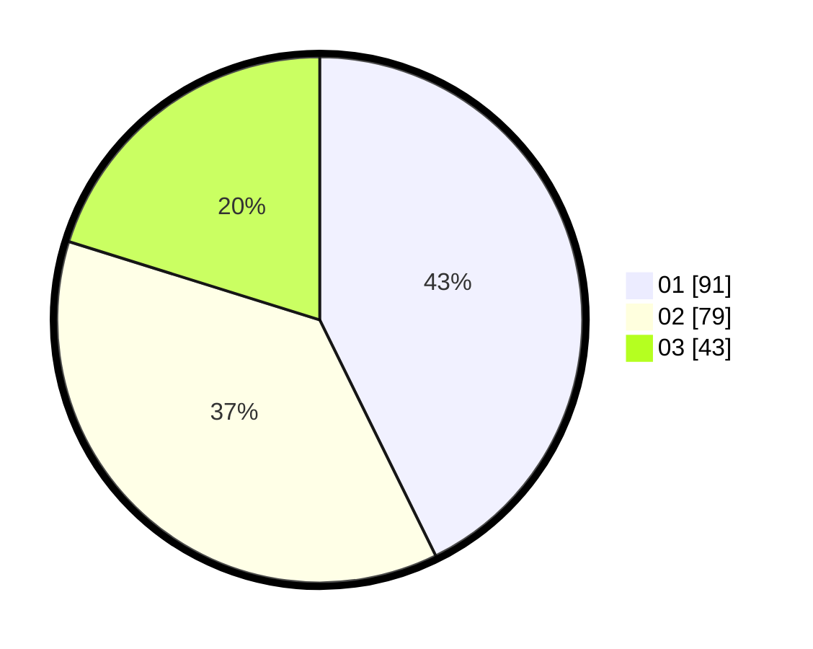

# Hasil

Hasil perolehan suara paslon dapat dilihat pada file paslon-01.txt, paslon-02.txt, dan paslon-03.txt.

Jika tidak ada, artinya data tersebut belum ada pada SIREKAP.

## Perolehan Suara

 * Paslon 01: **91**.
 * Paslon 02: **79**.
 * Paslon 03: **43**.

## Foto C Plano

https://sirekap-obj-formc.kpu.go.id/d91e/pemilu/ppwp/31/75/07/10/03/3175071003152-20240215-004330--c59542c1-b2db-4a5e-a202-15263a8c86da.jpg

https://sirekap-obj-formc.kpu.go.id/d91e/pemilu/ppwp/31/75/07/10/03/3175071003152-20240215-004335--a5192ac3-58b4-4775-9256-703a6f2b88c7.jpg

https://sirekap-obj-formc.kpu.go.id/d91e/pemilu/ppwp/31/75/07/10/03/3175071003152-20240215-004341--0c7ae387-b248-47d0-bea4-467f50ad63d5.jpg

## DATA PEMILIH TETAP

Jumlah pemilih dalam DPT: **272**.
 * L: **130**.
 * P: **142**.

## DATA PENGGUNA HAK PILIH

Jumlah pengguna hak pilih dalam DPT: **206**.
 * L: **96**.
 * P: **110**.

Jumlah pengguna hak pilih dalam DPTb: **3**.
 * L: **1**.
 * P: **2**.

Jumlah pengguna hak pilih dalam DPK: **6**.
 * L: **3**.
 * P: **3**.

Jumlah pengguna hak pilih: **215**.
 * L: **100**.
 * P: **115**.

## JUMLAH SUARA SAH DAN TIDAK SAH

JUMLAH SELURUH SUARA SAH: **213**.

JUMLAH SUARA TIDAK SAH: **2**.

JUMLAH SELURUH SUARA SAH DAN SUARA TIDAK SAH: **215**.
