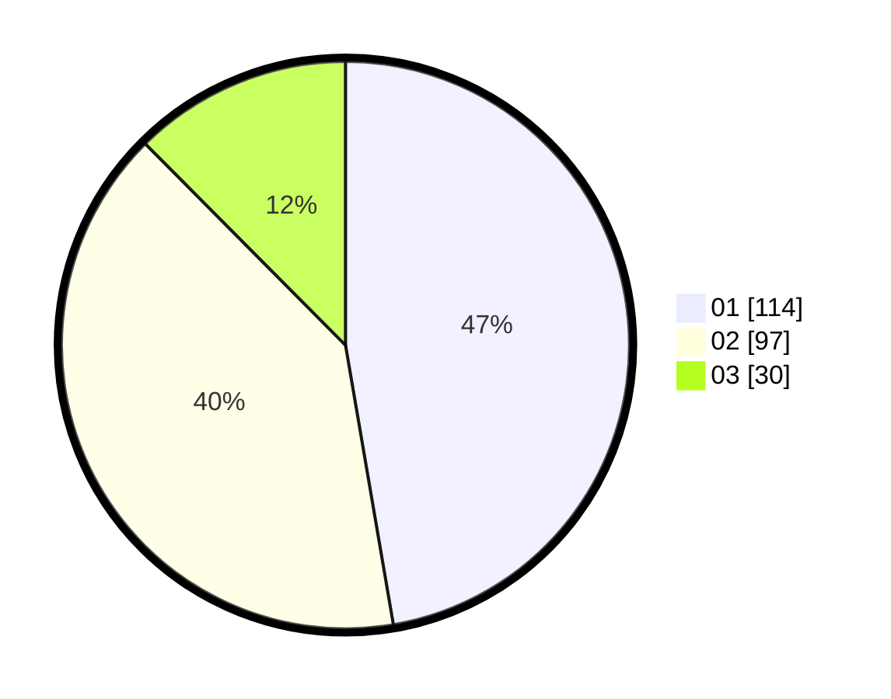

# Hasil

Hasil perolehan suara paslon dapat dilihat pada file paslon-01.txt, paslon-02.txt, dan paslon-03.txt.

Jika tidak ada, artinya data tersebut belum ada pada SIREKAP.

## Perolehan Suara

 * Paslon 01: **114**.
 * Paslon 02: **97**.
 * Paslon 03: **30**.

## Foto C Plano

https://sirekap-obj-formc.kpu.go.id/dd35/pemilu/ppwp/31/75/07/10/03/3175071003155-20240214-193628--d98c5e4b-2a42-4dc4-9426-530efc4e009b.jpg

https://sirekap-obj-formc.kpu.go.id/dd35/pemilu/ppwp/31/75/07/10/03/3175071003155-20240214-155233--0e8362d6-b2d1-4f9e-b382-dc6b041c3aef.jpg

https://sirekap-obj-formc.kpu.go.id/dd35/pemilu/ppwp/31/75/07/10/03/3175071003155-20240214-193756--8f7303a0-2829-4377-af7f-192b67ec331c.jpg

## DATA PEMILIH TETAP

Jumlah pemilih dalam DPT: **274**.
 * L: **147**.
 * P: **127**.

## DATA PENGGUNA HAK PILIH

Jumlah pengguna hak pilih dalam DPT: **224**.
 * L: **117**.
 * P: **107**.

Jumlah pengguna hak pilih dalam DPTb: **9**.
 * L: **3**.
 * P: **6**.

Jumlah pengguna hak pilih dalam DPK: **10**.
 * L: **2**.
 * P: **8**.

Jumlah pengguna hak pilih: **243**.
 * L: **122**.
 * P: **121**.

## JUMLAH SUARA SAH DAN TIDAK SAH

JUMLAH SELURUH SUARA SAH: **241**.

JUMLAH SUARA TIDAK SAH: **2**.

JUMLAH SELURUH SUARA SAH DAN SUARA TIDAK SAH: **243**.
