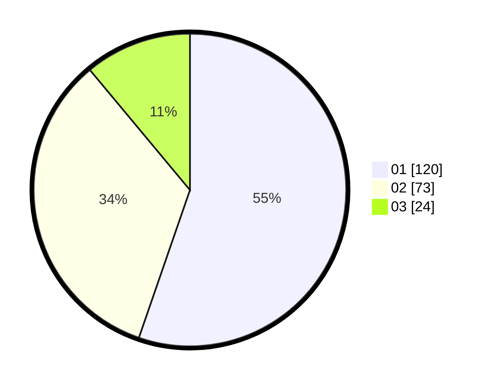

# Hasil

Hasil perolehan suara paslon dapat dilihat pada file paslon-01.txt, paslon-02.txt, dan paslon-03.txt.

Jika tidak ada, artinya data tersebut belum ada pada SIREKAP.

## Perolehan Suara

 * Paslon 01: **120**.
 * Paslon 02: **73**.
 * Paslon 03: **24**.

## Foto C Plano

https://sirekap-obj-formc.kpu.go.id/ccd6/pemilu/ppwp/31/75/07/10/03/3175071003157-20240216-132128--51b77b56-8314-4f5c-ab04-916d256b14f0.jpg

https://sirekap-obj-formc.kpu.go.id/ccd6/pemilu/ppwp/31/75/07/10/03/3175071003157-20240216-132129--daff40fb-c4a5-4bbb-8364-25e1127f61b5.jpg

https://sirekap-obj-formc.kpu.go.id/ccd6/pemilu/ppwp/31/75/07/10/03/3175071003157-20240216-132128--9a985514-83a2-4c4a-b115-6e05d39f372d.jpg

## DATA PEMILIH TETAP

Jumlah pemilih dalam DPT: **221**.
 * L: **109**.
 * P: **112**.

## DATA PENGGUNA HAK PILIH

Jumlah pengguna hak pilih dalam DPT: **220**.
 * L: **108**.
 * P: **112**.

Jumlah pengguna hak pilih dalam DPTb: **0**.
 * L: **0**.
 * P: **0**.

Jumlah pengguna hak pilih dalam DPK: **1**.
 * L: **1**.
 * P: **0**.

Jumlah pengguna hak pilih: **221**.
 * L: **109**.
 * P: **112**.

## JUMLAH SUARA SAH DAN TIDAK SAH

JUMLAH SELURUH SUARA SAH: **217**.

JUMLAH SUARA TIDAK SAH: **4**.

JUMLAH SELURUH SUARA SAH DAN SUARA TIDAK SAH: **221**.
