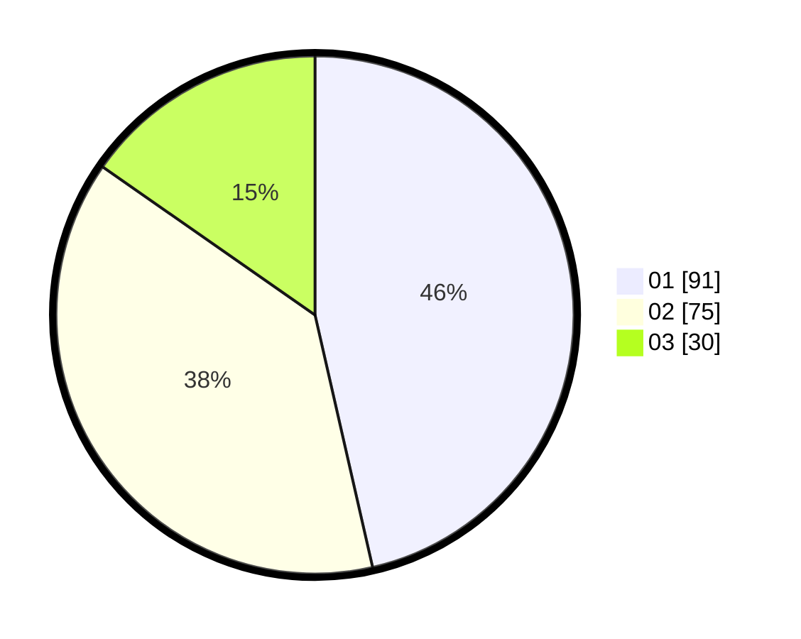

# Hasil

Hasil perolehan suara paslon dapat dilihat pada file paslon-01.txt, paslon-02.txt, dan paslon-03.txt.

Jika tidak ada, artinya data tersebut belum ada pada SIREKAP.

## Perolehan Suara

 * Paslon 01: **91**.
 * Paslon 02: **75**.
 * Paslon 03: **30**.

## Foto C Plano

https://sirekap-obj-formc.kpu.go.id/ce10/pemilu/ppwp/31/75/07/10/03/3175071003160-20240216-063346--f7b53476-9f13-49bd-a084-6b2a20278a09.jpg

https://sirekap-obj-formc.kpu.go.id/ce10/pemilu/ppwp/31/75/07/10/03/3175071003160-20240216-063347--0e2d60fa-255e-4ae0-8d81-a0210e06fd8c.jpg

https://sirekap-obj-formc.kpu.go.id/ce10/pemilu/ppwp/31/75/07/10/03/3175071003160-20240215-012823--39296e51-df42-4625-bd91-4d3d203f9130.jpg

## DATA PEMILIH TETAP

Jumlah pemilih dalam DPT: **277**.
 * L: **139**.
 * P: **138**.

## DATA PENGGUNA HAK PILIH

Jumlah pengguna hak pilih dalam DPT: **194**.
 * L: **94**.
 * P: **100**.

Jumlah pengguna hak pilih dalam DPTb: **3**.
 * L: **2**.
 * P: **1**.

Jumlah pengguna hak pilih dalam DPK: **1**.
 * L: **0**.
 * P: **1**.

Jumlah pengguna hak pilih: **198**.
 * L: **96**.
 * P: **102**.

## JUMLAH SUARA SAH DAN TIDAK SAH

JUMLAH SELURUH SUARA SAH: **196**.

JUMLAH SUARA TIDAK SAH: **2**.

JUMLAH SELURUH SUARA SAH DAN SUARA TIDAK SAH: **198**.
