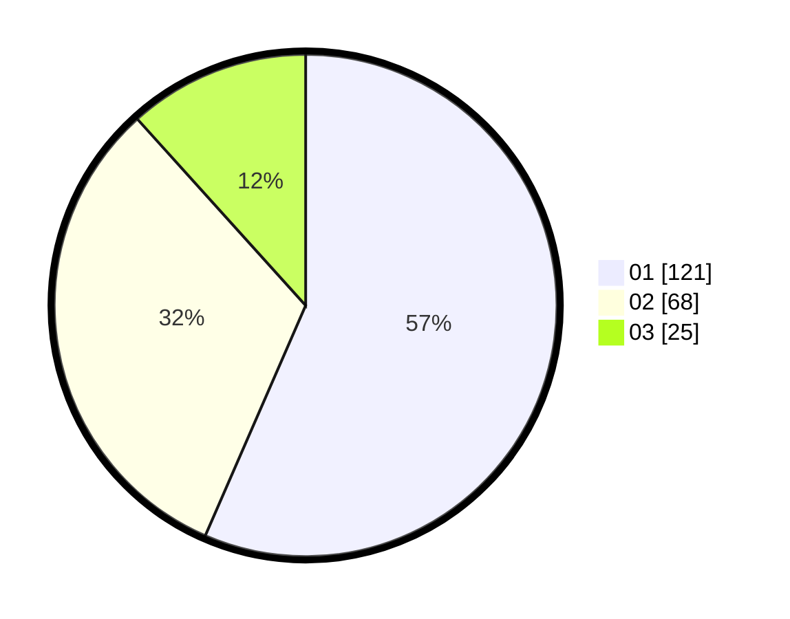

# Hasil

Hasil perolehan suara paslon dapat dilihat pada file paslon-01.txt, paslon-02.txt, dan paslon-03.txt.

Jika tidak ada, artinya data tersebut belum ada pada SIREKAP.

## Perolehan Suara

 * Paslon 01: **121**.
 * Paslon 02: **68**.
 * Paslon 03: **25**.

## Foto C Plano

https://sirekap-obj-formc.kpu.go.id/0079/pemilu/ppwp/31/75/07/10/03/3175071003164-20240216-133349--c78eb951-d11d-462c-841c-2a1ea88d69e0.jpg

https://sirekap-obj-formc.kpu.go.id/0079/pemilu/ppwp/31/75/07/10/03/3175071003164-20240216-133350--ac0df504-f51d-454d-b0a2-4bfad408fff2.jpg

https://sirekap-obj-formc.kpu.go.id/0079/pemilu/ppwp/31/75/07/10/03/3175071003164-20240216-133350--2eaa3eda-d218-4f9b-87a2-38e2b52919c0.jpg

## DATA PEMILIH TETAP

Jumlah pemilih dalam DPT: **271**.
 * L: **137**.
 * P: **134**.

## DATA PENGGUNA HAK PILIH

Jumlah pengguna hak pilih dalam DPT: **213**.
 * L: **106**.
 * P: **107**.

Jumlah pengguna hak pilih dalam DPTb: **3**.
 * L: **3**.
 * P: **0**.

Jumlah pengguna hak pilih dalam DPK: **3**.
 * L: **0**.
 * P: **3**.

Jumlah pengguna hak pilih: **219**.
 * L: **109**.
 * P: **110**.

## JUMLAH SUARA SAH DAN TIDAK SAH

JUMLAH SELURUH SUARA SAH: **214**.

JUMLAH SUARA TIDAK SAH: **5**.

JUMLAH SELURUH SUARA SAH DAN SUARA TIDAK SAH: **219**.
