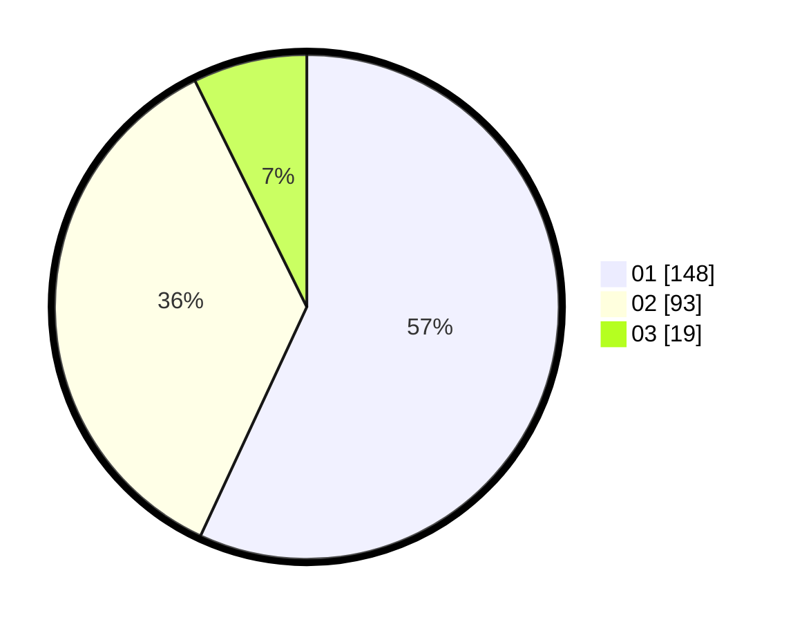

# Hasil

Hasil perolehan suara paslon dapat dilihat pada file paslon-01.txt, paslon-02.txt, dan paslon-03.txt.

Jika tidak ada, artinya data tersebut belum ada pada SIREKAP.

## Perolehan Suara

 * Paslon 01: **148**.
 * Paslon 02: **93**.
 * Paslon 03: **19**.

## Foto C Plano

https://sirekap-obj-formc.kpu.go.id/7a8f/pemilu/ppwp/31/75/07/10/03/3175071003165-20240216-091024--295acc77-1883-4b9a-8c23-5f676959c4b3.jpg

https://sirekap-obj-formc.kpu.go.id/7a8f/pemilu/ppwp/31/75/07/10/03/3175071003165-20240216-091028--54e93f82-e48f-46e0-8a38-8f8b9735c02e.jpg

https://sirekap-obj-formc.kpu.go.id/7a8f/pemilu/ppwp/31/75/07/10/03/3175071003165-20240216-091027--df3c8ebd-cb03-4331-9874-f124aa571900.jpg

## DATA PEMILIH TETAP

Jumlah pemilih dalam DPT: **265**.
 * L: **130**.
 * P: **135**.

## DATA PENGGUNA HAK PILIH

Jumlah pengguna hak pilih dalam DPT: **229**.
 * L: **110**.
 * P: **119**.

Jumlah pengguna hak pilih dalam DPTb: **23**.
 * L: **11**.
 * P: **12**.

Jumlah pengguna hak pilih dalam DPK: **11**.
 * L: **6**.
 * P: **5**.

Jumlah pengguna hak pilih: **263**.
 * L: **127**.
 * P: **136**.

## JUMLAH SUARA SAH DAN TIDAK SAH

JUMLAH SELURUH SUARA SAH: **260**.

JUMLAH SUARA TIDAK SAH: **3**.

JUMLAH SELURUH SUARA SAH DAN SUARA TIDAK SAH: **263**.
