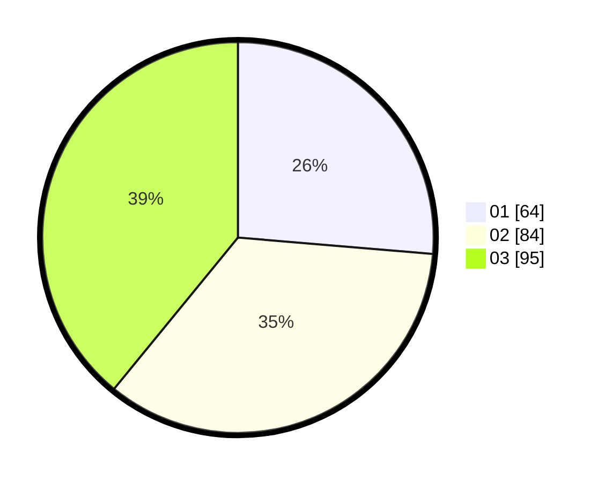

# Hasil

Hasil perolehan suara paslon dapat dilihat pada file paslon-01.txt, paslon-02.txt, dan paslon-03.txt.

Jika tidak ada, artinya data tersebut belum ada pada SIREKAP.

## Perolehan Suara

 * Paslon 01: **64**.
 * Paslon 02: **84**.
 * Paslon 03: **95**.

## Foto C Plano

https://sirekap-obj-formc.kpu.go.id/1e2e/pemilu/ppwp/31/75/07/10/03/3175071003177-20240215-010144--6209b221-1a4c-41e7-8f3a-e0120e025d1d.jpg

https://sirekap-obj-formc.kpu.go.id/1e2e/pemilu/ppwp/31/75/07/10/03/3175071003177-20240215-010346--a9cbf49b-faf3-4c66-8424-ab97972a4ae3.jpg

https://sirekap-obj-formc.kpu.go.id/1e2e/pemilu/ppwp/31/75/07/10/03/3175071003177-20240215-010432--aabc2d71-4330-4398-9e7a-ce5c1c4817a0.jpg

## DATA PEMILIH TETAP

Jumlah pemilih dalam DPT: **284**.
 * L: **142**.
 * P: **142**.

## DATA PENGGUNA HAK PILIH

Jumlah pengguna hak pilih dalam DPT: **239**.
 * L: **118**.
 * P: **121**.

Jumlah pengguna hak pilih dalam DPTb: **7**.
 * L: **2**.
 * P: **5**.

Jumlah pengguna hak pilih dalam DPK: **0**.
 * L: **0**.
 * P: **0**.

Jumlah pengguna hak pilih: **246**.
 * L: **120**.
 * P: **126**.

## JUMLAH SUARA SAH DAN TIDAK SAH

JUMLAH SELURUH SUARA SAH: **243**.

JUMLAH SUARA TIDAK SAH: **3**.

JUMLAH SELURUH SUARA SAH DAN SUARA TIDAK SAH: **246**.
