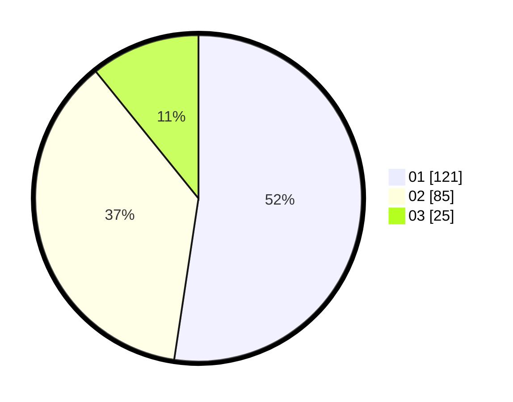

# Hasil

Hasil perolehan suara paslon dapat dilihat pada file paslon-01.txt, paslon-02.txt, dan paslon-03.txt.

Jika tidak ada, artinya data tersebut belum ada pada SIREKAP.

## Perolehan Suara

 * Paslon 01: **121**.
 * Paslon 02: **85**.
 * Paslon 03: **25**.

## Foto C Plano

https://sirekap-obj-formc.kpu.go.id/2375/pemilu/ppwp/31/75/07/10/03/3175071003178-20240216-033519--58c778eb-b323-46f7-a397-65033c651e9c.jpg

https://sirekap-obj-formc.kpu.go.id/2375/pemilu/ppwp/31/75/07/10/03/3175071003178-20240216-033521--018ec1ae-bf7d-4f68-930b-ed1612d30529.jpg

https://sirekap-obj-formc.kpu.go.id/2375/pemilu/ppwp/31/75/07/10/03/3175071003178-20240216-033520--55ef1900-1e98-4c08-ba91-65ddaa30b779.jpg

## DATA PEMILIH TETAP

Jumlah pemilih dalam DPT: **272**.
 * L: **128**.
 * P: **144**.

## DATA PENGGUNA HAK PILIH

Jumlah pengguna hak pilih dalam DPT: **230**.
 * L: **104**.
 * P: **126**.

Jumlah pengguna hak pilih dalam DPTb: **0**.
 * L: **0**.
 * P: **0**.

Jumlah pengguna hak pilih dalam DPK: **2**.
 * L: **0**.
 * P: **2**.

Jumlah pengguna hak pilih: **232**.
 * L: **104**.
 * P: **128**.

## JUMLAH SUARA SAH DAN TIDAK SAH

JUMLAH SELURUH SUARA SAH: **231**.

JUMLAH SUARA TIDAK SAH: **1**.

JUMLAH SELURUH SUARA SAH DAN SUARA TIDAK SAH: **232**.
