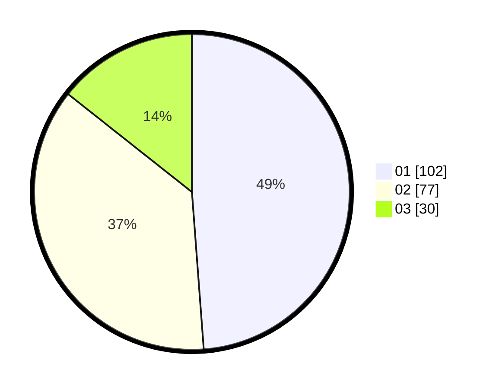

# Hasil

Hasil perolehan suara paslon dapat dilihat pada file paslon-01.txt, paslon-02.txt, dan paslon-03.txt.

Jika tidak ada, artinya data tersebut belum ada pada SIREKAP.

## Perolehan Suara

 * Paslon 01: **102**.
 * Paslon 02: **77**.
 * Paslon 03: **30**.

## Foto C Plano

https://sirekap-obj-formc.kpu.go.id/35da/pemilu/ppwp/31/75/07/10/03/3175071003181-20240215-204923--9733ab5f-ac3f-446b-ae17-1d8e39f8e8aa.jpg

https://sirekap-obj-formc.kpu.go.id/35da/pemilu/ppwp/31/75/07/10/03/3175071003181-20240215-204924--a1367bc8-c8b3-4f6c-b1c1-a11954650bfc.jpg

https://sirekap-obj-formc.kpu.go.id/35da/pemilu/ppwp/31/75/07/10/03/3175071003181-20240215-204924--2fb265cd-8f6d-4006-9430-6b676303b499.jpg

## DATA PEMILIH TETAP

Jumlah pemilih dalam DPT: **268**.
 * L: **145**.
 * P: **123**.

## DATA PENGGUNA HAK PILIH

Jumlah pengguna hak pilih dalam DPT: **210**.
 * L: **108**.
 * P: **102**.

Jumlah pengguna hak pilih dalam DPTb: **1**.
 * L: **0**.
 * P: **1**.

Jumlah pengguna hak pilih dalam DPK: **0**.
 * L: **0**.
 * P: **0**.

Jumlah pengguna hak pilih: **211**.
 * L: **108**.
 * P: **103**.

## JUMLAH SUARA SAH DAN TIDAK SAH

JUMLAH SELURUH SUARA SAH: **209**.

JUMLAH SUARA TIDAK SAH: **2**.

JUMLAH SELURUH SUARA SAH DAN SUARA TIDAK SAH: **211**.
