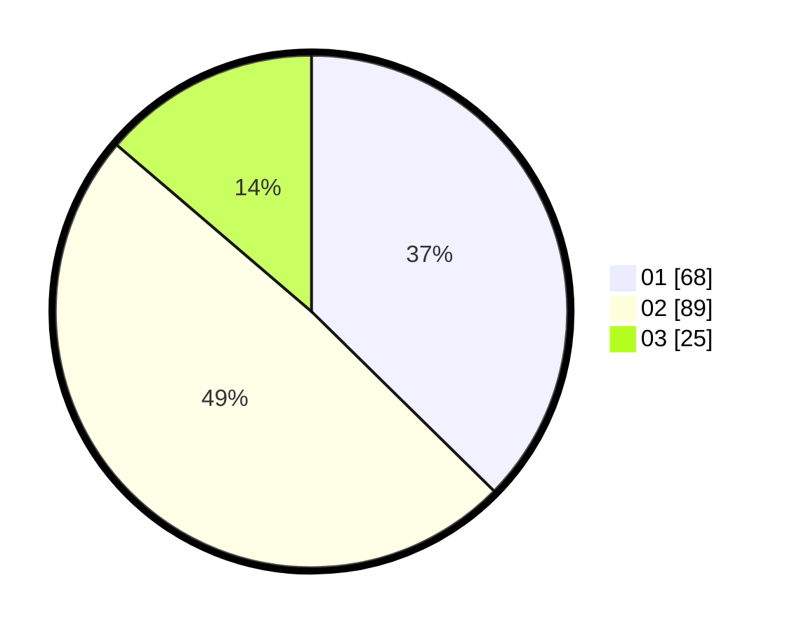

# Hasil

Hasil perolehan suara paslon dapat dilihat pada file paslon-01.txt, paslon-02.txt, dan paslon-03.txt.

Jika tidak ada, artinya data tersebut belum ada pada SIREKAP.

## Perolehan Suara

 * Paslon 01: **68**.
 * Paslon 02: **89**.
 * Paslon 03: **25**.

## Foto C Plano

https://sirekap-obj-formc.kpu.go.id/e4c3/pemilu/ppwp/31/75/07/10/03/3175071003182-20240214-155602--d263122d-25ac-4030-aa39-9f898d5da923.jpg

https://sirekap-obj-formc.kpu.go.id/e4c3/pemilu/ppwp/31/75/07/10/03/3175071003182-20240214-155623--592d7f94-23bd-4aaf-a7b2-91e283ecf992.jpg

https://sirekap-obj-formc.kpu.go.id/e4c3/pemilu/ppwp/31/75/07/10/03/3175071003182-20240214-155642--bcb9a85d-1a01-48dd-9d7d-b9d54a2d9d63.jpg

## DATA PEMILIH TETAP

Jumlah pemilih dalam DPT: **273**.
 * L: **140**.
 * P: **133**.

## DATA PENGGUNA HAK PILIH

Jumlah pengguna hak pilih dalam DPT: **182**.
 * L: **92**.
 * P: **90**.

Jumlah pengguna hak pilih dalam DPTb: **0**.
 * L: **0**.
 * P: **0**.

Jumlah pengguna hak pilih dalam DPK: **0**.
 * L: **0**.
 * P: **0**.

Jumlah pengguna hak pilih: **182**.
 * L: **92**.
 * P: **90**.

## JUMLAH SUARA SAH DAN TIDAK SAH

JUMLAH SELURUH SUARA SAH: **182**.

JUMLAH SUARA TIDAK SAH: **0**.

JUMLAH SELURUH SUARA SAH DAN SUARA TIDAK SAH: **182**.
