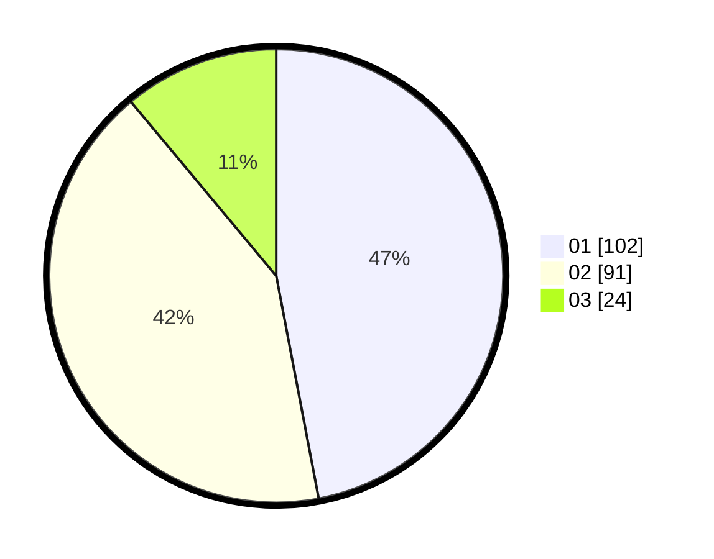

# Hasil

Hasil perolehan suara paslon dapat dilihat pada file paslon-01.txt, paslon-02.txt, dan paslon-03.txt.

Jika tidak ada, artinya data tersebut belum ada pada SIREKAP.

## Perolehan Suara

 * Paslon 01: **102**.
 * Paslon 02: **91**.
 * Paslon 03: **24**.

## Foto C Plano

https://sirekap-obj-formc.kpu.go.id/46b6/pemilu/ppwp/31/75/07/10/03/3175071003183-20240215-213444--a9a393ab-6873-49f6-8a3b-515c7cc68f8e.jpg

https://sirekap-obj-formc.kpu.go.id/46b6/pemilu/ppwp/31/75/07/10/03/3175071003183-20240215-213452--c08937b7-a42a-4c71-98ca-de83621c5e12.jpg

https://sirekap-obj-formc.kpu.go.id/46b6/pemilu/ppwp/31/75/07/10/03/3175071003183-20240215-213446--e4fcce3a-dd12-4aaa-bba5-1e961b8bca1e.jpg

## DATA PEMILIH TETAP

Jumlah pemilih dalam DPT: **272**.
 * L: **124**.
 * P: **148**.

## DATA PENGGUNA HAK PILIH

Jumlah pengguna hak pilih dalam DPT: **219**.
 * L: **95**.
 * P: **124**.

Jumlah pengguna hak pilih dalam DPTb: **0**.
 * L: **0**.
 * P: **0**.

Jumlah pengguna hak pilih dalam DPK: **0**.
 * L: **0**.
 * P: **0**.

Jumlah pengguna hak pilih: **219**.
 * L: **95**.
 * P: **124**.

## JUMLAH SUARA SAH DAN TIDAK SAH

JUMLAH SELURUH SUARA SAH: **217**.

JUMLAH SUARA TIDAK SAH: **2**.

JUMLAH SELURUH SUARA SAH DAN SUARA TIDAK SAH: **219**.
